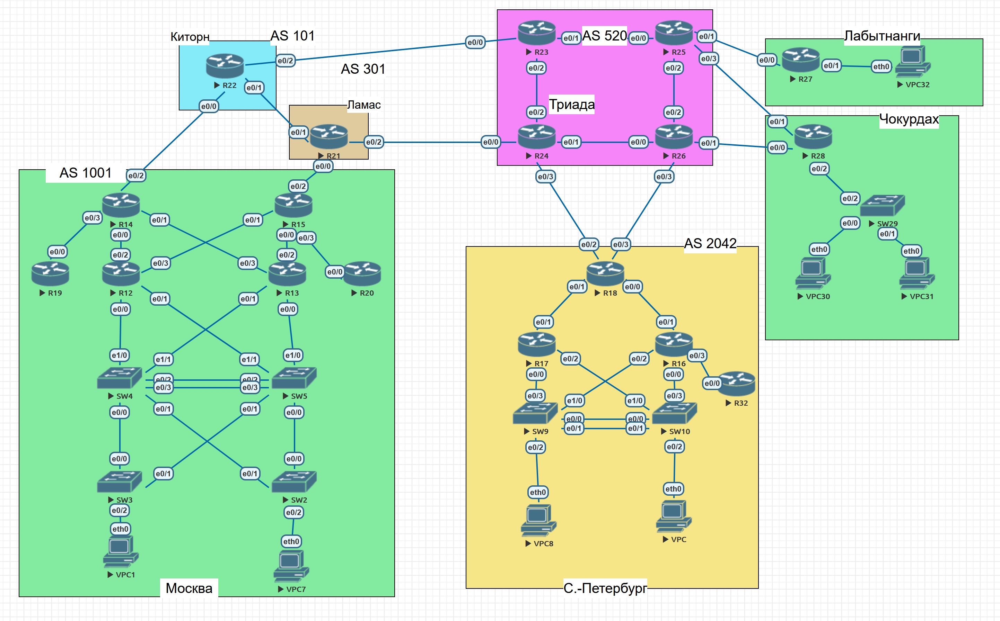

# IPv4/v6

### Задание:

1. Разработать и задокументировать адресное пространство
2. Задокументировать выделенные для маршрутизаторов IP-адреса.
3. Настроить каждый VPC в своем VLAN
4. Настроить VLAN для управления сетевых устройств

### Топология:

### 1. Задокументируем используемое адресное пространство.

### Общая таблица сетей.

#### Москва

| Network IPv4        | Summary net   | Network IPv6       | Summary net    | Description    | Dev&port  |
| ------------------- | ------------- | ------------------ | -------------- | -------------- | --------- |
| Routers             | 172.16.0.0/16 |                    | 2001:1:16::/48 |                |           |
| 172.16.32.0/30      |               | 2001:1:16:1::/64   |                | Москва         | R14 - R13 |
| 172.16.32.4/30      |               | 2001:1:16:2::/64   |                | Москва         | R14 - R12 |
| 172.16.32.8/30      |               | 2001:1:16:3::/64   |                | Москва         | R15 - R12 |
| 172.16.32.12/30     |               | 2001:1:16:4::/64   |                | Москва         | R15 - R13 |
| 172.16.32.16/30     |               | 2001:1:16:5::/64   |                | Москва         | R14 - R19 |
| 172.16.32.20/30     |               | 2001:1:16:6::/64   |                | Москва         | R15 - R20 |
| 172.16.32.24/30     |               | 2001:1:16:7::/64   |                | Москва         | R12 - SW4 |
| 172.16.32.28/30     |               | 2001:1:16:8::/64   |                | Москва         | R12 - SW5 |
| 172.16.32.32/30     |               | 2001:1:16:9::/64   |                | Москва         | R13 - SW4 |
| 172.16.32.36/30     |               | 2001:1:16:10::/64  |                | Москва         | R13 - SW5 |
| Servers / End Users | 172.16.0.0/16 |                    | 2001:1:16::/48 |                |           |
| 172.16.0.0/23       |               | 2001:1:16:201::/64 |                | Wired Data     | VLAN 10   |
| 172.16.4.0/23       |               | 2001:1:16:202::/64 |                | Wired Voice    | VLAN 15   |
| 172.16.8.0/23       |               | 2001:1:16:203::/64 |                | Wired Data     | VLAN 20   |
| 172.16.12.0/23      |               | 2001:1:16:204::/64 |                | Wired Voice    | VLAN 25   |
| 172.16.16.0/23      |               | 2001:1:16:205::/64 |                | Wireless       | VLAN 50   |
| 172.16.20.0/22      |               | 2001:1:16:206::/64 |                | Wireless Guest | VLAN 55   |
| 172.16.24.0/24      |               | 2001:1:16:207::/64 |                | Internet Edge  |           |
| 172.16.48.0/24      |               | 2001:1:16:208::/64 |                | Server Group 1 | VLAN 70   |
| 172.16.49.0/24      |               | 2001:1:16:209::/64 |                | Server Group 2 | VLAN 75   |

#### Санкт-Петербург

| Network IPv4        | Summary net   | Network IPv6       | Summary net    | Description    | Dev&port   |
| ------------------- | ------------- | ------------------ | -------------- | -------------- | ---------- |
| Routers             | 172.17.0.0/16 |                    | 2001:1:17::/48 |                |            |
| 172.17.32.0/30      |               | 2001:1:17:1::/64   |                | С.-Петербург   | R18 - R17  |
| 172.17.32.4/30      |               | 2001:1:17:2::/64   |                | С.-Петербург   | R18 - R16  |
| 172.17.32.8/30      |               | 2001:1:17:3::/64   |                | С.-Петербург   | R17 - SW9  |
| 172.17.32.12/30     |               | 2001:1:17:4::/64   |                | С.-Петербург   | R17 - SW10 |
| 172.17.32.16/30     |               | 2001:1:17:5::/64   |                | С.-Петербург   | R16 - SW9  |
| 172.17.32.20/30     |               | 2001:1:17:6::/64   |                | С.-Петербург   | R16 - SW10 |
| 172.17.32.24/30     |               | 2001:1:17:7::/64   |                | С.-Петербург   | R16 - R32  |
| Servers / End Users | 172.17.0.0/16 |                    | 2001:1:17::/48 |                |            |
| 172.17.0.0/23       |               | 2001:1:17:201::/64 |                | Wired Data     | VLAN 110   |
| 172.17.4.0/23       |               | 2001:1:17:202::/64 |                | Wired Voice    | VLAN 115   |
| 172.17.8.0/23       |               | 2001:1:17:203::/64 |                | Wired Data     | VLAN 120   |
| 172.17.12.0/23      |               | 2001:1:17:204::/64 |                | Wired Voice    | VLAN 125   |
| 172.17.16.0/23      |               | 2001:1:17:205::/64 |                | Wireless       | VLAN 150   |
| 172.17.20.0/22      |               | 2001:1:17:206::/64 |                | Wireless Guest | VLAN 155   |
| 172.17.24.0/24      |               | 2001:1:17:207::/64 |                | Internet Edge  |            |
| 172.17.48.0/24      |               | 2001:1:17:208::/64 |                | Server Group 1 | VLAN 170   |
| 172.17.49.0/24      |               | 2001:1:17:209::/64 |                | Server Group 2 | VLAN 175   |

#### Чокурдах

| Network IPv4        | Summary net   | Network IPv6       | Summary net    | Description    | Dev&port   |
| ------------------- | ------------- | ------------------ | -------------- | -------------- | ---------- |
| Routers             | 172.18.0.0/16 |                    | 2001:1:18::/48 |                |            |
| 172.18.32.0/30      |               | 2001:1:18:1::/64   |                | Чокурдах       | R28 - SW29 |
| Servers / End Users | 172.18.0.0/16 |                    | 2001:1:18::/48 |                |            |
| 172.18.0.0/24       |               | 2001:1:18:201::/64 |                | Wired Data     | VLAN 310   |
| 172.18.4.0/24       |               | 2001:1:18:202::/64 |                | Wired Voice    | VLAN 315   |
| 172.18.8.0/24       |               | 2001:1:18:203::/64 |                | Wired Data     | VLAN 320   |
| 172.18.12.0/24      |               | 2001:1:18:204::/64 |                | Wired Voice    | VLAN 325   |
| 172.18.16.0/24      |               | 2001:1:18:205::/64 |                | Wireless       | VLAN 350   |
| 172.18.20.0/23      |               | 2001:1:18:206::/64 |                | Wireless Guest | VLAN 355   |
| 172.18.48.0/24      |               | 2001:1:18:208::/64 |                | Server Group   | VLAN 370   |

#### Лабытнанги

| Network IPv4        | Summary net   | Network IPv6       | Summary net    | Description    | Dev&port |
| ------------------- | ------------- | ------------------ | -------------- | -------------- | -------- |
| Servers / End Users | 172.19.0.0/16 |                    | 2001:1:19::/48 |                |          |
| 172.19.0.0/24       |               | 2001:1:19:201::/64 |                | Wired Data     |          |
| 172.19.4.0/24       |               | 2001:1:19:202::/64 |                | Wired Voice    |          |
| 172.19.16.0/24      |               | 2001:1:19:205::/64 |                | Wireless       |          |
| 172.1920.0/24       |               | 2001:1:19:206::/64 |                | Wireless Guest |          |

#### Триада

| Network IPv4   | Summary net | Network IPv6      | Summary net | Description | Eq&port             |
| -------------- | ----------- | ----------------- | ----------- | ----------- | ------------------- |
| 198.0.52.0/29  |             | 2001:1:520:1::/64 |             |             | R23 e0/2 - R24 e0/2 |
| 198.0.52.8/29  |             | 2001:1:520:2::/64 |             |             | R23 e0/1 - R25 e0/0 |
| 198.0.52.16/29 |             | 2001:1:520:3::/64 |             |             | R24 e0/1 - R26 e0/0 |
| 198.0.52.24/29 |             | 2001:1:520:4::/64 |             |             | R25 e0/2 - R26 e0/2 |

#### Триада - Киторн

| Network IPv4   | Summary net | Network IPv6        | Summary net | Description | Eq&port             |
| -------------- | ----------- | ------------------- | ----------- | ----------- | ------------------- |
| 198.0.52.32/29 |             | 2001:1:520:101::/64 |             |             | R23 e0/0 - R22 e0/2 |

#### Триада - Ламас

| Network IPv4   | Summary net | Network IPv6        | Summary net | Description | Eq&port             |
| -------------- | ----------- | ------------------- | ----------- | ----------- | ------------------- |
| 198.0.52.36/29 |             | 2001:1:520:301::/64 |             |             | R24 e0/0 - R21 e0/2 |

#### Триада - Санкт-Петербург

| Network IPv4   | Summary net | Network IPv6         | Summary net | Description | Eq&port             |
| -------------- | ----------- | -------------------- | ----------- | ----------- | ------------------- |
| 198.0.52.40/30 |             | 2001:1:520:1042::/64 |             |             | R24 e0/3 - R18 e0/2 |
| 198.0.52.44/30 |             | 2001:1:520:1043::/64 |             |             | R26 e0/3 - R18 e0/2 |

#### Триада - Чокурдах

| Network IPv4   | Summary net | Network IPv6         | Summary net | Description | Eq&port             |
| -------------- | ----------- | -------------------- | ----------- | ----------- | ------------------- |
| 198.0.52.48/30 |             | 2001:1:520:1051::/64 |             |             | R25 e0/3 - R28 e0/1 |
| 198.0.52.52/30 |             | 2001:1:520:1052::/64 |             |             | R26 e0/1 - R28 e0/0 |

#### Триада - Лабытнанги

| Network IPv4   | Summary net | Network IPv6         | Summary net | Description | Eq&port             |
| -------------- | ----------- | -------------------- | ----------- | ----------- | ------------------- |
| 198.0.52.56/30 |             | 2001:1:520:1061::/64 |             |             | R25 e0/1 - R27 e0/0 |

#### Москва - Киторн

| Network IPv4   | Summary net | Network IPv6         | Summary net | Description | Eq&port             |
| -------------- | ----------- | -------------------- | ----------- | ----------- | ------------------- |
| 188.0.101.0/30 |             | 2001:1:101:1001::/64 |             |             | R22 e0/0 - R14 e0/2 |

#### Москва - Ламас

| Network IPv4 | Summary net | Network IPv6         | Summary net | Description | Eq&port             |
| ------------ | ----------- | -------------------- | ----------- | ----------- | ------------------- |
| 98.0.31.0/30 |             | 2001:1:301:1001::/64 |             |             | R21 e0/0 - R15 e0/2 |

#### Киторн - Ламас

| Network IPv4   | Summary net | Network IPv6        | Summary net | Description | Eq&port             |
| -------------- | ----------- | ------------------- | ----------- | ----------- | ------------------- |
| 188.0.101.5/30 |             | 2001:1:101:301::/64 |             |             | R22 e0/1 - R21 e0/1 |

### Management Loopbacks

| Network IPv4    | Network IPv6      | Description |
| --------------- | ----------------- | ----------- |
| 172.16.255.0/27 | 2001:1:16:FF::/64 | Москва      |
| 172.17.255.0/27 | 2001:1:17:FF::/64 | Питер       |
| 172.18.255.0/27 | 2001:1:18:FF::/64 | Чокурдах    |
| 172.19.255.0/27 | 2001:1:19:FF::/64 | Лабытнанги  |

### 

### 2. Задокументируем выделенные для маршрутизаторов IP-адреса.

Общая таблица сетевых адресов на интерфейсах маршрутизаторов.

## Москва

| Equip | Port  | AddrType | Address                | Network              | Description |
| ----- | ----- | -------- | ---------------------- | -------------------- | ----------- |
| R14   | e0/1  | IPv4     | 172.16.32.1/30         | 172.16.32.0/30       | R14 to R13  |
|       |       | IPv6     | 2001:1:16:1::14/64     | 2001:1:16:1::/64     |             |
|       |       | IPv6 LL  | FE80::14               | FE80::/10            |             |
| R14   | e0/0  | IPv4     | 172.16.32.5/30         | 172.16.32.4/30       | R14 to R12  |
|       |       | IPv6     | 2001:1:16:2::14/64     | 2001:1:16:2::/64     |             |
|       |       | IPv6 LL  | FE80::14               | FE80::/10            |             |
| R14   | e0/3  | IPv4     | 172.16.32.17/30        | 172.16.32.16/30      | R14 to R19  |
|       |       | IPv6     | 2001:1:16:5::14/64     | 2001:1:16:5::/64     |             |
|       |       | IPv6 LL  | FE80::14               | FE80::/10            |             |
| R14   | e0/2  | IPv4     | 188.0.1.2/30           | 188.0.1.0/30         | R14 to R22  |
|       |       | IPv6     | 2001:1:101:1001::14/64 | 2001:1:101:1001::/64 |             |
|       |       | IPv6 LL  | FE80::14               | FE80::/10            |             |
| R15   | e0/1  | IPv4     | 172.16.32.9/30         | 172.16.32.8/30       | R15 to R12  |
|       |       | IPv6     | 2001:1:16:3::15/64     | 2001:1:16:3::/64     |             |
|       |       | IPv6 LL  | FE80::15               | FE80::/10            |             |
| R15   | e0/0  | IPv4     | 172.16.32.13/30        | 172.16.32.12/30      | R15 to R13  |
|       |       | IPv6     | 2001:1:16:4::15/64     | 2001:1:16:4::/64     |             |
|       |       | IPv6 LL  | FE80::15               | FE80::/10            |             |
| R15   | e0/3  | IPv4     | 172.16.32.21/30        | 172.16.32.20/30      | R15 to R20  |
|       |       | IPv6     | 2001:1:16:6::15/64     | 2001:1:16:6::/64     |             |
|       |       | IPv6 LL  | FE80::15               | FE80::/10            |             |
| R15   | e0/2  | IPv4     | 98.0.31.2/30           | 98.0.31.0/30         | R15 to R21  |
|       |       | IPv6     | 2001:1:301:1001::15/64 | 2001:1:16:3::/64     |             |
|       |       | IPv6 LL  | FE80::15               | FE80::/10            |             |
| R19   | e0/0  | Pv4      | 172.16.32.18/30        | 172.16.32.16/30      | R19 to R14  |
|       |       | IPv6     | 2001:1:16:5::19/64     | 2001:1:16:5::/64     |             |
|       |       | IPv6 LL  | FE80::19               | FE80::/10            |             |
| R20   | e0/0  | IPv4     | 172.16.32.22/30        | 172.16.32.20/30      | R20 to R15  |
|       |       | IPv6     | 2001:1:16:6::20/64     | 2001:1:16:6::/64     |             |
|       |       | IPv6 LL  | FE80::20               | FE80::/10            |             |
| R12   | e0/2  | IPv4     | 172.16.32.6/30         | 172.16.32.4/30       | R12 to R14  |
|       |       | IPv6     | 2001:1:16:2::12/64     | 2001:1:16:2::/64     |             |
|       |       | IPv6 LL  | FE80::12               | FE80::/10            |             |
| R12   | e0/3  | IPv4     | 172.16.32.10/30        | 172.16.32.8/30       | R12 to R15  |
|       |       | IPv6     | 2001:1:16:3::12/64     | 2001:1:16:3::/64     |             |
|       |       | IPv6 LL  | FE80::12               | FE80::/10            |             |
| R12   | e0/0  | IPv4     | 172.16.32.25/30        | 172.16.32.24/30      | R12 to SW4  |
|       |       | IPv6     | 2001:1:16:7::12/64     | 2001:1:16:7::/64     |             |
|       |       | IPv6 LL  | FE80::12               | FE80::/10            |             |
| R12   | e0/1  | IPv4     | 172.16.32.29/30        | 172.16.32.28/30      | R12 to SW5  |
|       |       | IPv6     | 2001:1:16:8::12/64     | 2001:1:16:8::/64     |             |
|       |       | IPv6 LL  | FE80::12               | FE80::/10            |             |
| R13   | e0/3  | IPv4     | 172.16.32.2/30         | 172.16.32.0/30       | R13 to R14  |
|       |       | IPv6     | 2001:1:16:1::13/64     | 2001:1:16:1::/64     |             |
|       |       | IPv6 LL  | FE80::13               | FE80::/10            |             |
| R13   | e0/2  | IPv4     | 172.16.32.14/30        | 172.16.32.12/30      | R13 to R15  |
|       |       | IPv6     | 2001:1:16:4::13/64     | 2001:1:16:4::/64     |             |
|       |       | IPv6 LL  | FE80::13               | FE80::/10            |             |
| R13   | e0/1  | IPv4     | 172.16.32.33/30        | 172.16.32.32/30      | R13 to SW4  |
|       |       | IPv6     | 2001:1:16:9::13/64     | 2001:1:16:9::/64     |             |
|       |       | IPv6 LL  | FE80::13               | FE80::/10            |             |
| R13   | e0/0  | IPv4     | 172.16.32.37/30        | 172.16.32.36/30      | R13 to SW5  |
|       |       | IPv6     | 2001:1:16:10::13/64    | 2001:1:16:10::/64    |             |
|       |       | IPv6 LL  | FE80::13               | FE80::/10            |             |
| SW4   | e0/1  | IPv4     | 172.16.32.26/30        | 172.16.32.24/30      | SW4 to R12  |
|       |       | IPv6     | 2001:1:16:7::4/64      | 2001:1:16:7::/64     |             |
|       |       | IPv6 LL  | FE80::4                | FE80::/10            |             |
| SW4   | e1/1  | IPv4     | 172.16.32.34/30        | 172.16.32.32/30      | SW4 to R13  |
|       |       | IPv6     | 2001:1:16:9::4/64      | 2001:1:16:9::/64     |             |
|       |       | IPv6 LL  | FE80::4                | FE80::/10            |             |
| SW4   | SVI10 | IPv4     | 172.16.0.1/22          | 172.16.0.0/22        | GW VLAN 10  |
|       |       | IPv6     | 2001:1:16:201::1       | 2001:1:16:201::/64   | GW VLAN 10  |
|       |       | IPv6     | FE80::4                | FE80::/10            |             |
| SW5   | e0/1  | IPv4     | 172.16.32.30/30        | 172.16.32.28/30      | SW5 to R12  |
|       |       | IPv6     | 2001:1:16:8::5/64      | 2001:1:16:8::/64     |             |
|       |       | IPv6 LL  | FE80::5                | FE80::/10            |             |
| SW5   | e1/0  | IPv4     | 172.16.32.38/30        | 172.16.32.36/30      | SW5 to R13  |
|       |       | IPv6     | 2001:1:16:10::5/64     | 2001:1:16:10::/64    |             |
|       |       | IPv6 LL  | FE80::5                | FE80::/10            |             |
| SW5   | SVI20 | IPv4     | 172.16.8.1/22          | 172.16.8.0/22        | GW VLAN 20  |
|       |       | IPv6     | 2001:1:16:203::1       | 2001:1:16:203::/64   | GW VLAN 20  |
|       |       | IPv6     | FE80::5                | FE80::/10            |             |

## Санкт-Петербург

| Equip | Port   | AddrType | Address                | Network              | Description |
| ----- | ------ | -------- | ---------------------- | -------------------- | ----------- |
| R18   | e0/1   | IPv4     | 172.17.32.1/30         | 172.17.32.0/30       | R18 to R17  |
|       |        | IPv6     | 2001:1:17:1::18/64     | 2001:1:17:1::/64     |             |
|       |        | IPv6 LL  | FE80::18               | FE80::/10            |             |
| R18   | e0/0   | IPv4     | 172.17.32.5/30         | 172.16.32.4/30       | R18 to R16  |
|       |        | IPv6     | 2001:1:17:2::18/64     | 2001:1:17:2::/64     |             |
|       |        | IPv6 LL  | FE80::18               | FE80::/10            |             |
| R18   | e0/2   | IPv4     | 198.0.52.42/30         | 198.0.52.40/30       | R18 to R24  |
|       |        | IPv6     | 2001:1:520:1042::18/64 | 2001:1:520:1042::/64 |             |
|       |        | IPv6 LL  | FE80::18               | FE80::/10            |             |
| R18   | e0/3   | IPv4     | 198.0.52.46/30         | 198.0.52.44/30       | R18 to R26  |
|       |        | IPv6     | 2001:1:520:1043::18/64 | 2001:1:520:1043::/64 |             |
|       |        | IPv6 LL  | FE80::18               | FE80::/10            |             |
| R17   | e0/0   | IPv4     | 172.17.32.9/30         | 172.17.32.8/30       | R17 to SW9  |
|       |        | IPv6     | 2001:1:17:3::17/64     | 2001:1:17:3::/64     |             |
|       |        | IPv6 LL  | FE80::18               | FE80::/10            |             |
| R17   | e0/2   | IPv4     | 172.17.32.13/30        | 172.17.32.12/30      | R17 to SW10 |
|       |        | IPv6     | 2001:1:17:4::17/64     | 2001:1:17:4::/64     |             |
|       |        | IPv6 LL  | FE80::17               | FE80::/10            |             |
| R17   | e0/1   | IPv4     | 172.17.32.2/30         | 172.17.32.0/30       | R18 to R17  |
|       |        | IPv6     | 2001:1:17:1::17/64     | 2001:1:17:1::/64     |             |
|       |        | IPv6 LL  | FE80::17               | FE80::/10            |             |
| R16   | e0/2   | IPv4     | 172.17.32.17/30        | 172.17.32.16/30      | R16 to SW9  |
|       |        | IPv6     | 2001:1:17:5::16/64     | 2001:1:17:5::/64     |             |
|       |        | IPv6 LL  | FE80::16               | FE80::/10            |             |
| R16   | e0/0   | IPv4     | 172.17.32.21/30        | 172.17.32.20/30      | R16 to SW10 |
|       |        | IPv6     | 2001:1:17:6::16/64     | 2001:1:17:6::/64     |             |
|       |        | IPv6 LL  | FE80::16               | FE80::/10            |             |
| R16   | e0/3   | IPv4     | 172.17.32.25/30        | 172.17.32.24/30      | R16 to R32  |
|       |        | IPv6     | 2001:1:17:7::16/64     | 2001:1:17:7::/64     |             |
|       |        | IPv6 LL  | FE80::16               | FE80::/10            |             |
| R32   | e0/0   | IPv4     | 172.17.32.26/30        | 172.17.32.24/30      | R32 to R16  |
|       |        | IPv6     | 2001:1:17:7::32/64     | 2001:1:17:7::/64     |             |
|       |        | IPv6 LL  | FE80::32               | FE80::/10            |             |
| SW9   | e0/3   | IPv4     | 172.17.32.10/30        | 172.17.32.8/30       | SW9 to R17  |
|       |        | IPv6     | 2001:1:17:3::9/64      | 2001:1:17:3::/64     |             |
|       |        | IPv6 LL  | FE80::9                | FE80::/10            |             |
| SW9   | e1/0   | IPv4     | 172.17.32.18/30        | 172.17.32.16/30      | SW9 to R16  |
|       |        | IPv6     | 2001:1:17:5::9/64      | 2001:1:17:5::/64     |             |
|       |        | IPv6 LL  | FE80::9                | FE80::/10            |             |
| SW9   | SVI110 | IPv4     | 172.17.0.1/23          | 172.17.0.0/22        | GW VLAN 110 |
|       |        | IPv6     | 2001:1:17:201::1       | 2001:1:16:201::/64   | GW VLAN 110 |
|       |        | IPv6     | FE80::9                | FE80::/10            |             |
| SW10  |        | IPv4     | 172.17.32.14/30        | 172.17.32.12/30      | R17 to SW10 |
|       |        | IPv6     | 2001:1:17:4::10/64     | 2001:1:17:4::/64     |             |
|       |        | IPv6 LL  | FE80::10               | FE80::/10            |             |
| SW10  |        | IPv4     | 172.17.32.22/30        | 172.17.32.20/30      | SW10 to R16 |
|       |        | IPv6     | 2001:1:17:6::10/64     | 2001:1:17:6::/64     |             |
|       |        | IPv6 LL  | FE80::10               | FE80::/10            |             |
| SW10  | SVI120 | IPv4     | 172.17.8.1/23          | 172.17.8.0/22        | GW VLAN 120 |
|       |        | IPv6     | 2001:1:17:201::1       | 2001:1:17:201::/64   | GW VLAN 120 |
|       |        | IPv6     | FE80::10               | FE80::/10            |             |

## Чокурдах

| Equip | Port  | AddrType | Address                | Network              | Description |
| ----- | ----- | -------- | ---------------------- | -------------------- | ----------- |
| R28   | e0/2  | IPv4     | 172.18.32.1/30         | 172.18.32.0/30       | R28 to SW29 |
|       |       | IPv6     | 2001:1:18:1::28/64     | 2001:1:18:1::/64     |             |
|       |       | IPv6 LL  | FE80::28               | FE80::/10            |             |
| R28   | e0/1  | IPv4     | 198.0.52.50/30         | 198.0.52.48/30       | R28 to R25  |
|       |       | IPv6     | 2001:1:520:1051::28/64 | 2001:1:520:1051::/64 |             |
|       |       | IPv6 LL  | FE80::28               | FE80::/10            |             |
| R28   | e0/0  | IPv4     | 198.0.52.54/30         | 198.0.52.52/30       | R28 to R26  |
|       |       | IPv6     | 2001:1:520:1052::28/64 | 2001:1:520:1052::/64 |             |
|       |       | IPv6 LL  | FE80::28               | FE80::/10            |             |
| SW29  | e0/2  | IPv4     | 172.18.32.2/30         | 172.18.32.0/30       | R28 to SW29 |
|       |       | IPv6     | 2001:1:18:1::29/64     | 2001:1:18:1::/64     |             |
|       |       | IPv6 LL  | FE80::29               | FE80::/10            |             |
| SW29  | SVI10 | IPv4     | 172.18.0.1/24          | 172.18.0.0/24        | GW VLAN 310 |
|       |       | IPv6     | 2001:1:18:201::1       | 2001:1:18:201::/64   | GW VLAN 310 |
|       |       | IPv6     | FE80::29               | FE80::/10            |             |

## Лабытнанги

| Equip | Port | AddrType | Address                | Network              | Description |
| ----- | ---- | -------- | ---------------------- | -------------------- | ----------- |
| R27   | e0/0 | IPv4     | 198.0.52.58/30         | 198.0.52.56/30       | R27 to R25  |
|       |      | IPv6     | 2001:1:520:1061::27/64 | 2001:1:520:1061::/64 |             |
|       |      | IPv6 LL  | FE80::27               | FE80::/10            |             |

## Триада

| Equip | Port | AddrType | Address                | Network              | Description |
| ----- | ---- | -------- | ---------------------- | -------------------- | ----------- |
| R25   | e0/1 | IPv4     | 198.0.52.57/30         | 198.0.52.56/30       | R25 to R27  |
|       |      | IPv6     | 2001:1:520:1061::25/64 | 2001:1:520:1061::/64 |             |
|       |      | IPv6 LL  | FE80::25               | FE80::/10            |             |
| R25   | e0/3 | IPv4     | 198.0.52.49/30         | 198.0.52.48/30       | R25 to R28  |
|       |      | IPv6     | 2001:1:520:1051::25/64 | 2001:1:520:1051::/64 |             |
|       |      | IPv6 LL  | FE80::25               | FE80::/10            |             |
| R25   | e0/2 | IPv4     | 198.0.52.25/30         | 198.0.52.24/30       | R25 to R26  |
|       |      | IPv6     | 2001:1:520:4::25/64    | 2001:1:520:4::/64    |             |
|       |      | IPv6 LL  | FE80::25               | FE80::/10            |             |
| R25   | e0/0 | IPv4     | 198.0.52.10/30         | 198.0.52.8/30        | R25 to R23  |
|       |      | IPv6     | 2001:1:520:2::25/64    | 2001:1:520:2::/64    |             |
|       |      | IPv6 LL  | FE80::25               | FE80::/10            |             |
| R26   | e0/1 | IPv4     | 198.0.52.53/30         | 198.0.52.52/30       | R28 to R26  |
|       |      | IPv6     | 2001:1:520:1052::26/64 | 2001:1:520:1052::/64 |             |
|       |      | IPv6 LL  | FE80::26               | FE80::/10            |             |
| R26   | e0/3 | IPv4     | 198.0.52.45/30         | 198.0.52.44/30       | R18 to R26  |
|       |      | IPv6     | 2001:1:520:1043::26/64 | 2001:1:520:1043::/64 |             |
|       |      | IPv6 LL  | FE80::26               | FE80::/10            |             |
| R26   | e0/0 | IPv4     | 198.0.52.18/30         | 198.0.52.16/30       | R26 to R24  |
|       |      | IPv6     | 2001:1:520:3::26/64    | 2001:1:520:3::/64    |             |
|       |      | IPv6 LL  | FE80::26               | FE80::/10            |             |
| R26   | e0/2 | IPv4     | 198.0.52.26/30         | 198.0.52.24/30       | R26 to R25  |
|       |      | IPv6     | 2001:1:520:4::26/64    | 2001:1:520:4::/64    |             |
|       |      | IPv6 LL  | FE80::26               | FE80::/10            |             |
| R24   | e0/1 | IPv4     | 198.0.52.17/30         | 198.0.52.16/30       | R24 to R26  |
|       |      | IPv6     | 2001:1:520:3::24/64    | 2001:1:520:3::/64    |             |
|       |      | IPv6 LL  | FE80::24               | FE80::/10            |             |
| R24   | e0/2 | IPv4     | 198.0.52.2/30          | 198.0.52.0/30        | R24 to R23  |
|       |      | IPv6     | 2001:1:520:1::24/64    | 2001:1:520:1::/64    |             |
|       |      | IPv6 LL  | FE80::24               | FE80::/10            |             |
| R24   | e0/3 | IPv4     | 198.0.52.41/30         | 198.0.52.40/30       | R24 to R18  |
|       |      | IPv6     | 2001:1:520:1042::24/64 | 2001:1:520:1042::/64 |             |
|       |      | IPv6 LL  | FE80::24               | FE80::/10            |             |
| R24   | e0/0 | IPv4     | 198.0.52.37/30         | 198.0.52.36/30       | R24 to R21  |
|       |      | IPv6     | 2001:1:520:301::24/64  | 2001:1:520:301::/64  |             |
|       |      | IPv6 LL  | FE80::24               | FE80::/10            |             |
| R23   | e0/1 | IPv4     | 198.0.52.9/30          | 198.0.52.8/30        | R23 to R25  |
|       |      | IPv6     | 2001:1:520:2::23/64    | 2001:1:520:2::/64    |             |
|       |      | IPv6 LL  | FE80::23               | FE80::/10            |             |
| R23   | e0/2 | IPv4     | 198.0.52.1/30          | 198.0.52.0/30        | R23 to R24  |
|       |      | IPv6     | 2001:1:520:1::23/64    | 2001:1:520:1::/64    |             |
|       |      | IPv6 LL  | FE80::23               | FE80::/10            |             |
| R23   | e0/0 | IPv4     | 198.0.52.33/30         | 198.0.52.32/30       | R23 to R22  |
|       |      | IPv6     | 2001:1:520:101::23/64  | 2001:1:520:101::/64  |             |
|       |      | IPv6 LL  | FE80::23               | FE80::/10            |             |

## Киторн

| Equip | Port | AddrType | Address                | Network              | Description |
| ----- | ---- | -------- | ---------------------- | -------------------- | ----------- |
| R22   | e0/0 | IPv4     | 188.0.1.1/30           | 188.0.1.0/30         | R22 to R14  |
|       |      | IPv6     | 2001:1:101:1001::22/64 | 2001:1:101:1001::/64 |             |
|       |      | IPv6 LL  | FE80::22               | FE80::/10            |             |
| R22   | e0/1 | IPv4     | 188.0.101.5/30         | 188.0.101.4/30       | R22 to R21  |
|       |      | IPv6     | 2001:1:101:301::22/64  | 2001:1:101:301::/64  |             |
|       |      | IPv6 LL  | FE80::22               | FE80::/10            |             |
| R22   | e0/2 | IPv4     | 198.0.52.34/30         | 198.0.52.32/30       | R22 to R23  |
|       |      | IPv6     | 2001:1:520:101::24/64  | 2001:1:520:101::/64  |             |
|       |      | IPv6 LL  | FE80::22               | FE80::/10            |             |

## Ламас

| Equip | Port | AddrType | Address                | Network             | Description |
| ----- | ---- | -------- | ---------------------- | ------------------- | ----------- |
| R21   | e0/1 | IPv4     | 188.0.101.6/30         | 188.0.101.4/30      | R21 to R22  |
|       |      | IPv6     | 2001:1:101:301::21/64  | 2001:1:101:301::/64 |             |
|       |      | IPv6 LL  | FE80::21               | FE80::/10           |             |
| R21   | e0/1 | IPv4     | 198.0.52.38/30         | 198.0.52.36/30      | R21 to R24  |
|       |      | IPv6     | 2001:1:520:301::21/64  | 2001:1:520:301::/64 |             |
|       |      | IPv6 LL  | FE80::21               | FE80::/10           |             |
| R21   | e0/2 | IPv4     | 98.0.31.1/30           | 98.0.31.0/30        | R21 to R15  |
|       |      | IPv6     | 2001:1:301:1001::21/64 | 2001:1:16:3::/64    |             |
|       |      | IPv6 LL  | FE80::21               | FE80::/10           |             |

