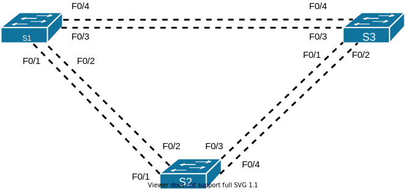
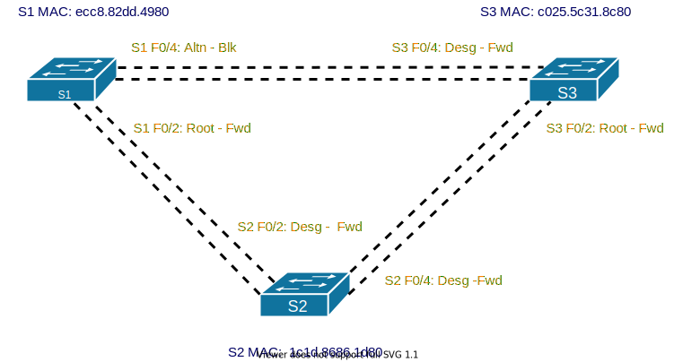

# Развертывание коммутируемой сети с резервными каналами
### Топология:



### Таблица адресации:
 
| Устройство | Интерфейс | IP-адрес    | Маска подсети |
| --------   | --------  | ----------- | ------------- |
| S1         | VLAN 1    | 192.168.1.1 | 255.255.255.0 |
| S2         | VLAN 1    | 192.168.1.2 | 255.255.255.0 |
| S3         | VLAN 1    | 192.168.1.3 | 255.255.255.0 |

### Цели
#### Часть 1. Создание сети и настройка основных параметров устройства
#### Часть 2. Выбор корневого моста
#### Часть 3. Наблюдение за процессом выбора протоколом STP порта, исходя из стоимости портов
#### Часть 4. Наблюдение за процессом выбора протоколом STP порта, исходя из приоритета портов

### Часть 1. Создание сети и настройка основных параметров устройства

#### Настройка базовых параметров для каждого устройства:
* Отключение поиска DNS
* Присвоение имени устройству в соответствии с топологией
* Назначение пароля доступа к привилегированному режиму, пароля консоли и VTY
* Настройка logging synchronous для консольного канала
* Настройка баннерного сообщения дня для предупреждения пользователей о запрете несанкционированного доступа
* Задание IP-адреса, указанного в таблице адресации для VLAN 1
* Копирование текущей конфигурации в файл загрузочной конфигурации

Подключение к коммутатору и вход в привилегированный режим:<br>
`enable`

Вход в режим конфигурации:<br>
`configure terminal`

Указание имени коммутатора:<br>
`hostname S1` - на S1<br>
`hostname S2` - на S2<br>
`hostname S3` - на S3

Отключение разрешения имен DNS:<br>
`no ip domain-lookup`

Установка паролей на вход в привилегированный режим, консольному и терминальному подключенииям. Включение шифрования паролей в виде простого текста. Установка режима logging synchronous для консольного подключения:

```
enable secret class
line console 0
password cisco
login
logging synchronous
exit
line vty 0 15
password cisco
login
exit
service password-encryption
```

Установка баннера при подключении

```
banner motd ^C
===============================================================================
        Connections are logged. Unauthorized access is prohibited.           
===============================================================================
^C
```

Присвоение IP-адреса интерфейсу VLAN 1 согласно таблице

На S1
```
interface Vlan1
ip address 192.168.1.1 255.255.255.0
```

На S2
```
interface Vlan1
ip address 192.168.1.2 255.255.255.0
```

На S3
```
interface Vlan1
ip address 192.168.1.3 255.255.255.0
```

Копирование текущей конфигурации в файл стартовой конфигурации<br>
`copy running-config startup-config`

#### Проверка связи между коммутаторами

Эхо-запросы между коммутаторами выполняются успешно после поднятия интерфейса VLAN 1 на коммутаторах

```
interface VLAN 1
no shutdown
```

### Часть 2. Определение корневого моста

Отключение всех портов на коммутаторах:

```
interface range FastEthernet 0/1-24
shutdown
```

Настройка подключенных портов в качестве транковых
```
interface range FastEthernet 0/1-4
switchport mode trunk
```

Включение портов  F0/2, F0/4 на всех коммутаторах
```
interface range FastEthernet 0/2, FastEthernet 0/4
no shutdown
```
Отображение данных протокола spanning-tree
```
S1#show spanning-tree
VLAN0001
  Spanning tree enabled protocol ieee
  Root ID    Priority    32769
             Address     1c1d.8686.1d80
             Cost        19
             Port        4 (FastEthernet0/4)
             Hello Time   2 sec  Max Age 20 sec  Forward Delay 15 sec
  Bridge ID  Priority    32769  (priority 32768 sys-id-ext 1)
             Address     ecc8.82dd.4980
             Hello Time   2 sec  Max Age 20 sec  Forward Delay 15 sec
             Aging Time  300 sec
Interface           Role Sts Cost      Prio.Nbr Type
------------------- ---- --- --------- -------- --------------------------------
Fa0/2               Root FWD 19        128.2    P2p 
Fa0/4               Altn BLK 19        128.4    P2p 

```
```
S2#show spanning-tree 
VLAN0001
  Spanning tree enabled protocol ieee
  Root ID    Priority    32769
             Address     1c1d.8686.1d80
             This bridge is the root
             Hello Time   2 sec  Max Age 20 sec  Forward Delay 15 sec
  Bridge ID  Priority    32769  (priority 32768 sys-id-ext 1)
             Address     1c1d.8686.1d80
             Hello Time   2 sec  Max Age 20 sec  Forward Delay 15 sec
             Aging Time  300 sec
Interface           Role Sts Cost      Prio.Nbr Type
------------------- ---- --- --------- -------- --------------------------------
Fa0/2               Desg FWD 19        128.2    P2p 
Fa0/4               Desg FWD 19        128.4    P2p 
```
```
S3#show spanning-tree 
VLAN0001
  Spanning tree enabled protocol ieee
  Root ID    Priority    32769
             Address     1c1d.8686.1d80
             Cost        19
             Port        2 (FastEthernet0/2)
             Hello Time   2 sec  Max Age 20 sec  Forward Delay 15 sec
  Bridge ID  Priority    32769  (priority 32768 sys-id-ext 1)
             Address     c025.5c31.8c80
             Hello Time   2 sec  Max Age 20 sec  Forward Delay 15 sec
             Aging Time  300 sec
Interface           Role Sts Cost      Prio.Nbr Type
------------------- ---- --- --------- -------- --------------------------------
Fa0/2               Root FWD 19        128.2    P2p 
Fa0/4               Desg FWD 19        128.4    P2p 
```

Роль и состояние активных портов в топологии:



**Какой коммутатор является корневым мостом?**<br>
S2<br>

**Почему этот коммутатор был выбран протоколом spanning-tree в качестве корневого моста?**<br>
У коммутатора S2 наименьший MAC-адрес при равном Priority<br>

**Какие порты на коммутаторе являются корневыми портами?**<br>
S1 F0/2, S3 F0/2<br>

**Какие порты на коммутаторе являются назначенными портами?**<br>
S2 F0/2, S2 F0/4, S3 F0/4<br>

**Какой порт отображается в качестве альтернативного и в настоящее время заблокирован?**<br>
S1 F0/4<br>

**Почему протокол spanning-tree выбрал этот порт в качестве невыделенного (заблокированного) порта?**<br>
Bridge ID S1 выше, чем Bridge ID S3

### Часть 3. Наблюдение за процессом выбора протоколом STP порта, исходя из стоимости портов

Коммутатор с заблокированным портом: S1

Изменение стоимости порта
```
interface FastEthernet 0/2
spanning-tree cost 18
```
Изменение протокола spanning-tree:
```
S1#show spanning-tree 
VLAN0001
  Spanning tree enabled protocol ieee
  Root ID    Priority    32769
             Address     1c1d.8686.1d80
             Cost        18
             Port        4 (FastEthernet0/4)
             Hello Time   2 sec  Max Age 20 sec  Forward Delay 15 sec
  Bridge ID  Priority    32769  (priority 32768 sys-id-ext 1)
             Address     ecc8.82dd.4980
             Hello Time   2 sec  Max Age 20 sec  Forward Delay 15 sec
             Aging Time  15  sec
Interface           Role Sts Cost      Prio.Nbr Type
------------------- ---- --- --------- -------- --------------------------------
Fa0/2               Root FWD 18        128.2    P2p
Fa0/4               Desg FWD 19        128.4    P2p 
```
```
S2#show spanning-tree 
VLAN0001
  Spanning tree enabled protocol ieee
  Root ID    Priority    32769
             Address     1c1d.8686.1d80
             This bridge is the root
             Hello Time   2 sec  Max Age 20 sec  Forward Delay 15 sec
  Bridge ID  Priority    32769  (priority 32768 sys-id-ext 1)
             Address     1c1d.8686.1d80
             Hello Time   2 sec  Max Age 20 sec  Forward Delay 15 sec
             Aging Time  300 sec
Interface           Role Sts Cost      Prio.Nbr Type
------------------- ---- --- --------- -------- --------------------------------
Fa0/2               Desg FWD 19        128.2    P2p 
Fa0/4               Desg FWD 19        128.4    P2p 

```
```
S3#show spanning-tree 
VLAN0001
  Spanning tree enabled protocol ieee
  Root ID    Priority    32769
             Address     1c1d.8686.1d80
             Cost        19
             Port        2 (FastEthernet0/2)
             Hello Time   2 sec  Max Age 20 sec  Forward Delay 15 sec
  Bridge ID  Priority    32769  (priority 32768 sys-id-ext 1)
             Address     c025.5c31.8c80
             Hello Time   2 sec  Max Age 20 sec  Forward Delay 15 sec
             Aging Time  300 sec
Interface           Role Sts Cost      Prio.Nbr Type
------------------- ---- --- --------- -------- --------------------------------
Fa0/2               Root FWD 19        128.2    P2p 
Fa0/4               Altn BLK 19        128.4    P2p 
```
**Почему протокол spanning-tree заменяет ранее заблокированный порт на назначенный порт и блокирует порт, который был назначенным портом на другом коммутаторе?**<br>
Назначенный порт выбирается по:
* Меньшему Root Path Cost.
* Меньшему Bridge ID.
* Меньшему Port ID. 

Так как Fa 0/4 на S1 теперь имеет меньшую стоимость пути к корневому мосту, то порт S1 Fa 0/4 стал назначенным, а S3 Fa 0/4 заблокирован.

Удаление изменения стоимости порта:
```
interface 0/2
no spanning-tree cost 18
```
### Часть 4. Наблюдение за процессом выбора протокола STP порта, исходя из приоритета портов.

Включение портов Fa 0/1, Fa 0/3 на всех коммутаторах:
```
interface range FastEthernet 0/1, FastEthernet 0/3
no shutdown
```
Информация spanning-tree на коммутаторах S1 и S2:
```
S1#show spanning-tree 
VLAN0001
  Spanning tree enabled protocol ieee
  Root ID    Priority    32769
             Address     1c1d.8686.1d80
             Cost        19
             Port        3 (FastEthernet0/3)
             Hello Time   2 sec  Max Age 20 sec  Forward Delay 15 sec
  Bridge ID  Priority    32769  (priority 32768 sys-id-ext 1)
             Address     ecc8.82dd.4980
             Hello Time   2 sec  Max Age 20 sec  Forward Delay 15 sec
             Aging Time  15  sec
Interface           Role Sts Cost      Prio.Nbr Type
------------------- ---- --- --------- -------- --------------------------------
Fa0/1               Root FWD 19        128.1    P2p
Fa0/2               Altn BLK 19        128.2    P2p 
Fa0/3               Altn BLK 19        128.3    P2p 
Fa0/4               Altn BLK 19        128.4    P2p 
```
```
S3#show spanning-tree 
VLAN0001
  Spanning tree enabled protocol ieee
  Root ID    Priority    32769
             Address     1c1d.8686.1d80
             Cost        19
             Port        1 (FastEthernet0/1)
             Hello Time   2 sec  Max Age 20 sec  Forward Delay 15 sec
  Bridge ID  Priority    32769  (priority 32768 sys-id-ext 1)
             Address     c025.5c31.8c80
             Hello Time   2 sec  Max Age 20 sec  Forward Delay 15 sec
             Aging Time  300 sec
Interface           Role Sts Cost      Prio.Nbr Type
------------------- ---- --- --------- -------- --------------------------------
Fa0/1               Root FWD 19        128.1    P2p 
Fa0/2               Altn BLK 19        128.2    P2p 
Fa0/3               Desg FWD 19        128.3    P2p 
Fa0/4               Desg FWD 19        128.4    P2p 
```

**Какой порт выбран протоколом STP в качестве порта корневого моста на каждом коммутаторе некорневого моста?**<br>
F0/1

**Почему протокол STP выбрал эти порты в качестве портов корневого моста на этих коммутаторах?**<br>
По наименьшей стоимости до корневого моста.

### Вопросы для повторения
**Какое значение протокол STP использует первым после выбора корневого моста, чтобы определить выбор порта?**<br>
Меньший Root Path Cost.<br>

**Если первое значение на двух портах одинаково, какое следующее значение будет использовать протокол STP при выборе порта?**<br>
Меньший Bridge ID.<br>

**Если оба значения на двух портах равны, каким будет следующее значение, которое использует протокол STP при выборе порта?**<br>
Меньший Port ID.
