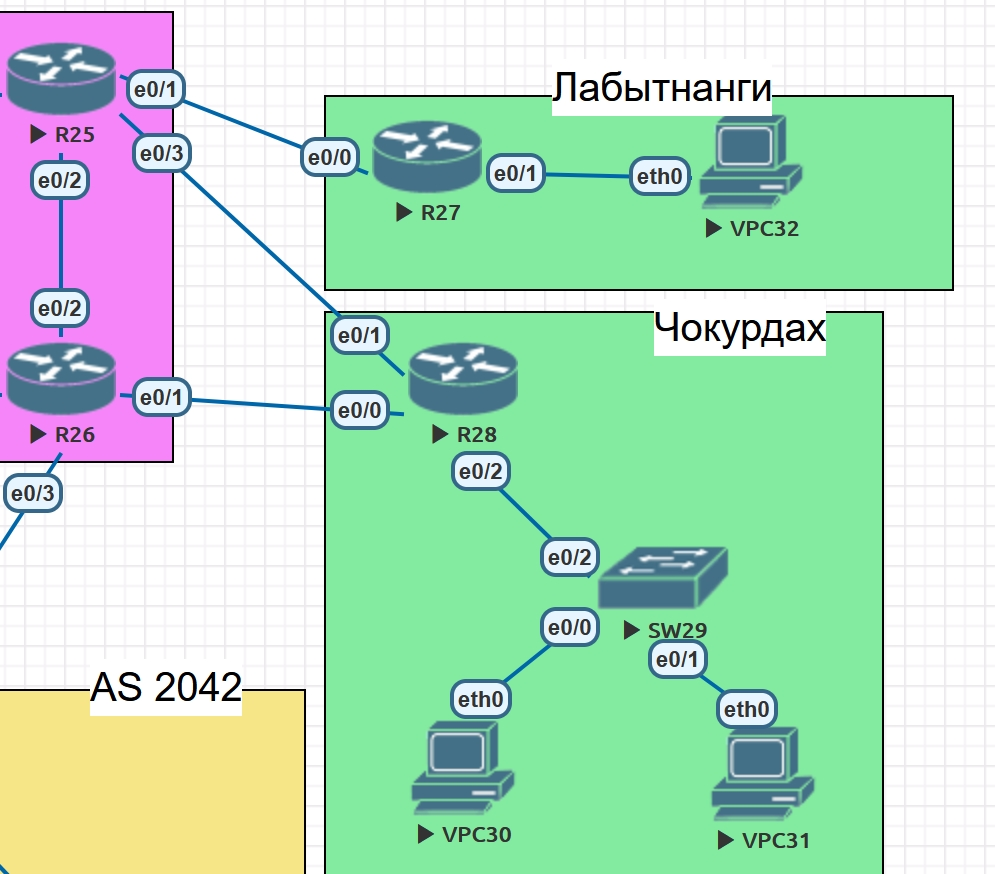

## Policy Based Routing

#### Задание:

##### Настроить политику маршрутизации в офисе Чокурдах.

1. Настроить политику маршрутизации для сетей офиса
2. Распределить трафик между двумя линками с провайдером
3. Настроить отслеживание линка через технологию IP SLA
4. Настроить для офиса Лабытнанги маршрут по-умолчанию


#### Топология



##### Настройка PBR в офисе Чокурдах

Настроим проверку доступности интерфейсов R25e0/3 (198.0.52.17) c помощью IP SLA на маршрутизаторе Чокурдах R28


```
ip sla 1
 icmp-echo 198.0.52.17 source-ip 198.0.52.18
 frequency 5
```

Настроим расписание проверки

`ip sla schedule 1 life forever start-time now`

Аналогично настроим проверку соединения с R26e0/1 (198.0.52.21)

```
ip sla 2
 icmp-echo 198.0.52.21 source-ip 198.0.52.22
 frequency 5
ip sla schedule 2 life forever start-time now
```

Настроим трекинг для IP SLA 1 и IP SLA 2

```
track 1 ip sla 1 reachability
 delay down 10 up 5
 
track 2 ip sla 2 reachability
 delay down 10 up 5
```

Создадим аксесс-листы для пользовательских VLAN 310 и VLAN 320

```
ip access-list standard ACL_VLAN310
 permit 172.18.0.0 0.0.0.255
ip access-list standard ACL_VLAN320
 permit 172.18.8.0 0.0.0.255
```

Создадим route-map для установки next-hop в зависимости от доступности линков.

```
route-map POLICY permit 10
 match ip address ACL_VLAN310
 set ip next-hop verify-availability 198.0.52.17 1 track 1
 set ip next-hop verify-availability 198.0.52.21 2 track 2

route-map POLICY permit 20
 match ip address ACL_VLAN320
 set ip next-hop verify-availability 198.0.52.21 1 track 2
 set ip next-hop verify-availability 198.0.52.17 2 track 1
```

Установим созданный route-map  на входящий интерфейс маршрутизатора R28

```
interface Ethernet0/2
 ip policy route-map POLICY
```


#### Проверка IP SLA и трекинга

Проверка работы IP SLA

```
R28#show ip sla statistics
IPSLAs Latest Operation Statistics

IPSLA operation id: 1
        Latest RTT: 1 milliseconds
Latest operation start time: 14:34:58 EET Mon Jun 21 2021
Latest operation return code: OK
Number of successes: 4
Number of failures: 159
Operation time to live: Forever


IPSLA operation id: 2
        Latest RTT: 1 milliseconds
Latest operation start time: 14:35:01 EET Mon Jun 21 2021
Latest operation return code: OK
Number of successes: 306
Number of failures: 0
Operation time to live: Forever
```

Проверка трекинга

```
R28# sh track br
Track Type        Instance                   Parameter        State Last Change
1     ip sla      1                          reachability     Up    00:02:58
2     ip sla      2                          reachability     Up    02:48:00
```

##### Проверка маршрутов при доступных и недоступных линках.

1. R26e0/1 (198.0.52.21) и R25e0/3 (198.0.52.17) доступны.

VLAN 310

```
VPCS30> trace 198.0.52.17
trace to 198.0.52.17, 8 hops max, press Ctrl+C to stop
 1   172.18.0.1   0.441 ms  0.272 ms  0.273 ms
 2   172.18.32.1   0.914 ms  0.459 ms  1.231 ms
 3   *198.0.52.17   1.318 ms (ICMP type:3, code:3, Destination port unreachable)  *
```

```
VPCS30> trace 198.0.52.21
trace to 198.0.52.21, 8 hops max, press Ctrl+C to stop
 1   172.18.0.1   0.562 ms  0.359 ms  0.348 ms
 2   172.18.32.1   0.829 ms  0.743 ms  0.694 ms
 3   198.0.52.17   1.597 ms  1.436 ms  2.322 ms
 4   198.0.52.18   1.014 ms  1.442 ms  1.104 ms
 5   *198.0.52.21   1.816 ms (ICMP type:3, code:3, Destination port unreachable)  *
```

VLAN 320

```
VPCS31> trace 198.0.52.17
trace to 198.0.52.17, 8 hops max, press Ctrl+C to stop
 1   172.18.8.1   0.304 ms  0.371 ms  0.334 ms
 2   172.18.32.1   1.447 ms  0.638 ms  1.729 ms
 3   198.0.52.21   1.573 ms  1.428 ms  0.767 ms
 4   198.0.52.22   1.032 ms  1.256 ms  0.843 ms
 5   *198.0.52.17   1.505 ms (ICMP type:3, code:3, Destination port unreachable)  *
```

```
VPCS31> trace 198.0.52.21
trace to 198.0.52.21, 8 hops max, press Ctrl+C to stop
 1   172.18.8.1   0.518 ms  0.331 ms  0.560 ms
 2   172.18.32.1   1.489 ms  0.958 ms  1.089 ms
 3   *198.0.52.21   2.088 ms (ICMP type:3, code:3, Destination port unreachable)  *
```

2. R26e0/1 (198.0.52.21) доступен, R25e0/3 (198.0.52.17) недоступен.

VLAN 310

```
VPCS30> trace 198.0.52.21
trace to 198.0.52.21, 8 hops max, press Ctrl+C to stop
 1   172.18.0.1   0.468 ms  0.388 ms  0.555 ms
 2   172.18.32.1   1.096 ms  0.965 ms  0.567 ms
 3   *198.0.52.21   1.361 ms (ICMP type:3, code:3, Destination port unreachable)  *
```

VLAN 320

```
VPC31> trace 198.0.52.21
trace to 198.0.52.21, 8 hops max, press Ctrl+C to stop
 1   172.18.8.1   0.544 ms  0.308 ms  0.459 ms
 2   172.18.32.1   1.031 ms  0.920 ms  0.673 ms
 3   *198.0.52.21   1.081 ms (ICMP type:3, code:3, Destination port unreachable)  **
```

3. R26e0/1 (198.0.52.21) недоступен, R25e0/3 (198.0.52.17) доступен.

   VLAN 310

   ```
   VPC30> trace 198.0.52.17
   trace to 198.0.52.17, 8 hops max, press Ctrl+C to stop
    1   172.18.0.1   0.310 ms  0.242 ms  0.242 ms
    2   172.18.32.1   1.072 ms  0.703 ms  0.894 ms
    3   *198.0.52.17   1.265 ms (ICMP type:3, code:3, Destination port unreachable)  *
   ```

   VLAN 320

   ```
   VPC31> trace 198.0.52.17
   trace to 198.0.52.17, 8 hops max, press Ctrl+C to stop
    1   172.18.8.1   0.485 ms  0.360 ms  0.367 ms
    2   172.18.32.1   1.010 ms  1.222 ms  0.737 ms
    3   *198.0.52.17   1.627 ms (ICMP type:3, code:3, Destination port unreachable)  *
   ```


#### Настройка в офисе Лабытнанги маршрута по-умолчанию

Настроим аксесс-лист для адресов 172.19.0.0/24 на маршрутизаторе R27

```
ip access-list standard ACL_LABYT
 permit 172.19.0.0 0.0.0.255
```

Создадим route-map для адресов 172.19.0.0/24 и установим next-hop 198.0.52.25

```
route-map RM_LABYT permit 10
 match ip address ACL_LABYT
 set ip next-hop 198.0.52.25
```

Применим route-map на входящий интерфейс e0/1

```
interface Ethernet0/1
 ip policy route-map RM_LABYT
```

##### Проверка

Настроим loopback-интерфейс на R25

```
int loopback 1
ip address 8.8.8.8 255.255.255.255
```

Проверим доступность адреса с VPC32

```
VPC32> trace 8.8.8.8
trace to 8.8.8.8, 8 hops max, press Ctrl+C to stop
 1   172.19.0.1   0.457 ms  0.360 ms  0.209 ms
 2   *198.0.52.25   0.700 ms (ICMP type:3, code:3, Destination port unreachable)  *
```

```
VPC32> ping 8.8.8.8
84 bytes from 8.8.8.8 icmp_seq=1 ttl=254 time=0.645 ms
84 bytes from 8.8.8.8 icmp_seq=2 ttl=254 time=1.050 ms
84 bytes from 8.8.8.8 icmp_seq=3 ttl=254 time=0.811 ms
84 bytes from 8.8.8.8 icmp_seq=4 ttl=254 time=1.065 ms
84 bytes from 8.8.8.8 icmp_seq=5 ttl=254 time=5.032 ms
```

