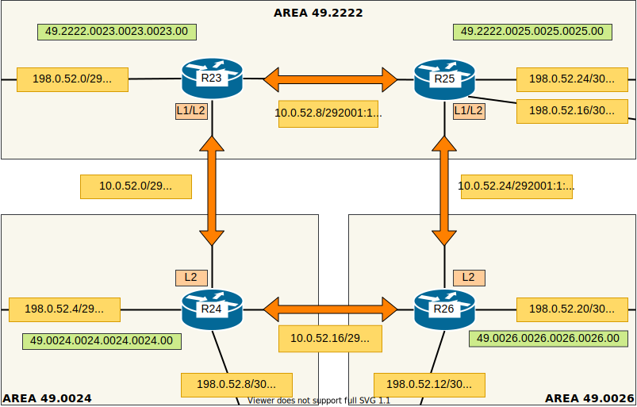

## IS-IS

#### Цель:

Настроить IS-IS офисе Триада

- Настроите IS-IS в ISP Триада
- R23 и R25 находятся в зоне 2222
- R24 находится в зоне 24
- R26 находится в зоне 26

Настройка осуществляется одновременно для IPv4 и IPv6


#### Топология



Оранжевые стрелки - backbone area

##### Произведем настройку на маршрутизаторах согласно топологии.

R23:

Включение IS-IS и указание Network Entity Title

```
router isis
 net 49.2222.0023.0023.0023.00
```

Настройка интерфейсов

```
interface Ethernet0/1
 ip router isis
 isis circuit-type level-1-2
 ipv6 router isis

interface Ethernet0/2
 ip router isis
 ipv6 router isis
 isis circuit-type level-2-only
```

Настроим остальные маршрутизаторы, аналогично R23


##### Проверка

IPv4

```
R23#sh isis neighbor

System Id      Type Interface   IP Address      State Holdtime Circuit Id
R24            L2   Et0/2       10.0.52.2       UP    8        R24.01
R25            L1   Et0/1       10.0.52.10      UP    7        R25.01
R25            L2   Et0/1       10.0.52.10      UP    9        R25.01
```

```
R23#sh ip route isis

Gateway of last resort is not set

      10.0.0.0/8 is variably subnetted, 8 subnets, 3 masks

i L2     10.0.52.0/29 [115/20] via 10.0.52.2, 00:32:05, Ethernet0/2
i L1     10.0.52.8/29 [115/20] via 10.0.52.10, 00:26:54, Ethernet0/1
i L2     10.0.52.16/29 [115/20] via 10.0.52.2, 00:25:26, Ethernet0/2
i L2     10.0.52.24/29 [115/20] via 10.0.52.10, 00:26:54, Ethernet0/1
```

IPv6

```
 R23#sh ipv6 route isis

I2  2001:1:520:3::/64 [115/30]
     via FE80::25, Ethernet0/1
I2  2001:1:520:4::/64 [115/20]
     via FE80::25, Ethernet0/1
```

