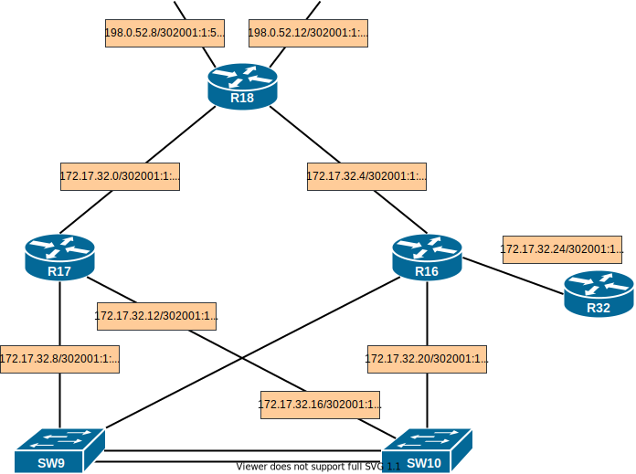

## EIGRP

#### Цель:

Настроить EIGRP в С.-Петербург; Использовать named EIGRP

1. В офисе С.-Петербург настроить EIGRP
2. R32 получает только маршрут по-умолчанию
3. R16-17 анонсируют только суммарные префиксы
4. Использовать EIGRP named-mode для настройки сети

Настройка осуществляется одновременно для IPv4 и IPv6


#### Топология




Настроим named EIGRP на маршрутизаторах

На R18:

```
(config)#router eigrp EI-PETER
```

Настроим EIGRP для IPv4. Укажем номер автономной системы EIGRP

```
(config-router)#address-family ipv4 unicast autonomous-system 10
```

Настроим router-id

```
(config-router-af)#eigrp router-id 0.0.0.18
```

Настроим поведение интерфейса по-умолчанию и активные интерфейсы

```
(config-router-af)#af-interface default

(config-router-af-interface)#passive-interface

(config-router-af-interface)#af-interface Ethernet0/0
(config-router-af-interface)#no passive-interface

(config-router-af-interface)#af-interface Ethernet0/1
(config-router-af-interface)#no passive-interface
```

Укажем разрешенные подсети для анонса

```
(config-router-af)#network 172.17.32.0 0.0.0.3

(config-router-af)#network 172.17.32.4 0.0.0.3
```

 

Настроим EIGRP для IPv6. Укажем номер автономной системы EIGRP

```
(config-router)address-family ipv6 unicast autonomous-system 10
```

Настроим router-id

```
(config-router-af)#eigrp router-id 0.0.0.18
```

Настроим интерфейс по-умолчанию и активные интерфейсы

```
(config-router-af)#af-interface default

(config-router-af-interface)#passive-interface

(config-router-af-interface)#af-interface Ethernet0/0
(config-router-af-interface)#no passive-interface

(config-router-af-interface)#af-interface Ethernet0/1
(config-router-af-interface)#no passive-interface
```

Настроим остальные маршрутизаторы аналогично.

На маршрутизаторах R17 и R16 просуммируем ipv4-маршруты на активных интерфейсах

```
(config-router-af-interface)#af-interface Ethernet0/0
(config-router-af-interface)#summary-address 172.17.32.0 255.255.255.224
```

На маршрутизаторе R18 зададим статический маршрут и настроим его редистрибуцию в EIGRP

```
(config)#ip route 0.0.0.0 0.0.0.0 198.0.52.9
...
(config-router)#address-family ipv4 unicast autonomous-system 10
(config-router-af)#topology base
(config-router-af-topology)#redistribute static
```

Произведем аналогичные настройки для IPv6

```
(config)#ip route ::/0 e0/2
...
(config-router)#address-family ipv6 unicast autonomous-system 10
(config-router-af)#topology base
(config-router-af-topology)#redistribute static
```

### Проверка

##### Таблица соседства IPv4 и IPv6

R18

```
EIGRP-IPv4 VR(EI-PETER) Address-Family Neighbors for AS(10)
H   Address                 Interface              Hold Uptime   SRTT   RTO  Q  Seq
                                                   (sec)         (ms)       Cnt Num
1   172.17.32.2             Et0/1                    12 1d04h       3   100  0  142
0   172.17.32.6             Et0/0                    12 1d04h       4   100  0  172
```

```
EIGRP-IPv6 VR(EI-PETER) Address-Family Neighbors for AS(10)
H   Address                 Interface              Hold Uptime   SRTT   RTO  Q  Seq
                                                   (sec)         (ms)       Cnt Num
1   Link-local address:     Et0/0                    11 06:08:23   13   100  0  29
    FE80::16
0   Link-local address:     Et0/1                    13 06:08:23   13   100  0  24
    FE80::17
```

R16

```
EIGRP-IPv4 VR(EI-PETER) Address-Family Neighbors for AS(10)
H   Address                 Interface              Hold Uptime   SRTT   RTO  Q  Seq
                                                   (sec)         (ms)       Cnt Num
2   172.17.32.22            Et0/0                    14 06:26:33   12   100  0  17
1   172.17.32.18            Et0/2                    13 07:09:09    7   100  0  24
3   172.17.32.26            Et0/3                    12 1d01h       5   100  0  41
0   172.17.32.5             Et0/1                    11 1d04h       5   100  0  118
```

```
EIGRP-IPv6 VR(EI-PETER) Address-Family Neighbors for AS(10)
H   Address                 Interface              Hold Uptime   SRTT   RTO  Q  Seq
                                                   (sec)         (ms)       Cnt Num
3   Link-local address:     Et0/3                    13 06:08:42   10   150  0  3
    FE80::32
0   Link-local address:     Et0/1                    13 06:10:00    8   100  0  6
    FE80::18
2   Link-local address:     Et0/0                    12 06:20:35    6   100  0  37
    FE80::10
1   Link-local address:     Et0/2                    11 06:20:35    8   100  0  45
    FE80::9
```

##### Таблица маршрутизации IPv4 и IPv6

R18

```
Gateway of last resort is 198.0.52.9 to network 0.0.0.0

S*    0.0.0.0/0 [1/0] via 198.0.52.9
      172.17.0.0/16 is variably subnetted, 6 subnets, 4 masks
D        172.17.0.0/23 [90/1541120] via 172.17.32.6, 07:11:29, Ethernet0/0
                       [90/1541120] via 172.17.32.2, 07:11:29, Ethernet0/1
D        172.17.32.0/27 [90/1536000] via 172.17.32.6, 08:37:48, Ethernet0/0
                        [90/1536000] via 172.17.32.2, 08:37:48, Ethernet0/1
C        172.17.32.0/30 is directly connected, Ethernet0/1
L        172.17.32.1/32 is directly connected, Ethernet0/1
C        172.17.32.4/30 is directly connected, Ethernet0/0
L        172.17.32.5/32 is directly connected, Ethernet0/0
      198.0.52.0/24 is variably subnetted, 4 subnets, 2 masks
C        198.0.52.8/30 is directly connected, Ethernet0/2
L        198.0.52.10/32 is directly connected, Ethernet0/2
C        198.0.52.12/30 is directly connected, Ethernet0/3
L        198.0.52.14/32 is directly connected, Ethernet0/3
```

```
S   ::/0 [1/0]
     via Ethernet0/2, directly connected
C   2001:1:17:1::/64 [0/0]
     via Ethernet0/1, directly connected
L   2001:1:17:1::18/128 [0/0]
     via Ethernet0/1, receive
C   2001:1:17:2::/64 [0/0]
     via Ethernet0/0, directly connected
L   2001:1:17:2::18/128 [0/0]
     via Ethernet0/0, receive
D   2001:1:17:3::/64 [90/1536000]
     via FE80::17, Ethernet0/1
D   2001:1:17:4::/64 [90/1536000]
     via FE80::17, Ethernet0/1
D   2001:1:17:5::/64 [90/1536000]
     via FE80::16, Ethernet0/0
D   2001:1:17:6::/64 [90/1536000]
     via FE80::16, Ethernet0/0
D   2001:1:17:7::/64 [90/1536000]
     via FE80::16, Ethernet0/0
C   2001:1:520:1042::/64 [0/0]
     via Ethernet0/2, directly connected
L   2001:1:520:1042::18/128 [0/0]
     via Ethernet0/2, receive
C   2001:1:520:1043::/64 [0/0]
     via Ethernet0/3, directly connected
L   2001:1:520:1043::18/128 [0/0]
     via Ethernet0/3, receive
L   FF00::/8 [0/0]
     via Null0, receive
```

R16

```
Gateway of last resort is 172.17.32.5 to network 0.0.0.0

D*EX  0.0.0.0/0 [170/1536000] via 172.17.32.5, 07:14:01, Ethernet0/1
      172.17.0.0/16 is variably subnetted, 13 subnets, 4 masks
D        172.17.0.0/23 [90/1029120] via 172.17.32.18, 07:14:01, Ethernet0/2
D        172.17.32.0/27 is a summary, 07:14:01, Null0
D        172.17.32.0/30 [90/1536000] via 172.17.32.5, 08:44:06, Ethernet0/1
C        172.17.32.4/30 is directly connected, Ethernet0/1
L        172.17.32.6/32 is directly connected, Ethernet0/1
D        172.17.32.8/30 [90/1536000] via 172.17.32.18, 07:14:02, Ethernet0/2
D        172.17.32.12/30 [90/1536000] via 172.17.32.22, 06:31:26, Ethernet0/0
C        172.17.32.16/30 is directly connected, Ethernet0/2
L        172.17.32.17/32 is directly connected, Ethernet0/2
C        172.17.32.20/30 is directly connected, Ethernet0/0
L        172.17.32.21/32 is directly connected, Ethernet0/0
C        172.17.32.24/30 is directly connected, Ethernet0/3
L        172.17.32.25/32 is directly connected, Ethernet0/3
```

```
EX  ::/0 [170/1536000]
     via FE80::18, Ethernet0/1
D   2001:1:17:1::/64 [90/1536000]
     via FE80::18, Ethernet0/1
C   2001:1:17:2::/64 [0/0]
     via Ethernet0/1, directly connected
L   2001:1:17:2::16/128 [0/0]
     via Ethernet0/1, receive
D   2001:1:17:3::/64 [90/1536000]
     via FE80::9, Ethernet0/2
D   2001:1:17:4::/64 [90/1536000]
     via FE80::10, Ethernet0/0
C   2001:1:17:5::/64 [0/0]
     via Ethernet0/2, directly connected
L   2001:1:17:5::16/128 [0/0]
     via Ethernet0/2, receive
C   2001:1:17:6::/64 [0/0]
     via Ethernet0/0, directly connected
L   2001:1:17:6::16/128 [0/0]
     via Ethernet0/0, receive
C   2001:1:17:7::/64 [0/0]
     via Ethernet0/3, directly connected
L   2001:1:17:7::16/128 [0/0]
     via Ethernet0/3, receive
L   FF00::/8 [0/0]
     via Null0, receive
```


##### Настройка машрутизатора R32 для получения маршрута по-умолчанию.

Создадим prefix-list  для IPv4 и IPv6

```
(config)#ip prefix-list NO32 seq 5 permit 0.0.0.0/0
(config)#ipv6 prefix-list NOEIGRPV6 seq 5 permit ::/0
```

Укажем prefix-list в конфигурации EIGRP на маршрутизаторе для фильтрации префиксов 0.0.0.0.0 и ::/0

```
(config-router)#address-family ipv4 unicast autonomous-system 10
(config-router-af)#topology base
(config-router-af-topology)#distribute-list prefix NO32 in
```

```
(config-router)#address-family ipv6 unicast autonomous-system 10
(config-router-af)#topology base
(config-router-af-topology)#distribute-list prefix-list NOEIGRPV6 in
```

Проверим получаемые маршруты

```
Gateway of last resort is 172.17.32.25 to network 0.0.0.0

D*EX  0.0.0.0/0 [170/2048000] via 172.17.32.25, 07:41:49, Ethernet0/0
      172.17.0.0/16 is variably subnetted, 2 subnets, 2 masks
C        172.17.32.24/30 is directly connected, Ethernet0/0
L        172.17.32.26/32 is directly connected, Ethernet0/0
```

```
EX  ::/0 [170/2048000]
     via FE80::16, Ethernet0/0
C   2001:1:17:7::/64 [0/0]
     via Ethernet0/0, directly connected
L   2001:1:17:7::32/128 [0/0]
     via Ethernet0/0, receive
L   FF00::/8 [0/0]
     via Null0, receive
```

