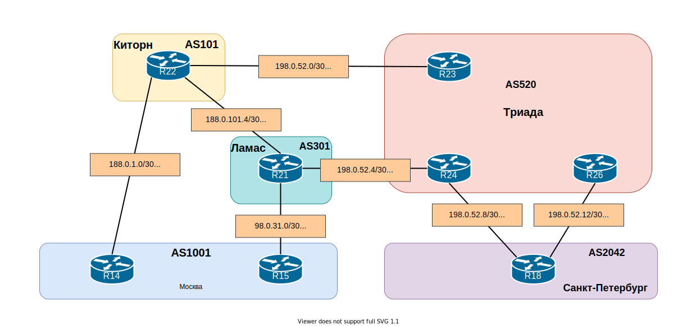

## BGP. Основы

### Цель:

Настроить BGP между автономными системами 

Организовать доступность между офисами Москва и С.-Петербург

- Настроить eBGP между офисом Москва и двумя провайдерами - Киторн и Ламас;
- Настроить eBGP между провайдерами Киторн и Ламас;
- Настроить eBGP между Ламас и Триада;
- eBGP между офисом С.-Петербург и провайдером Триада;
- Организовать IP доступность между офисами Москва и С.-Петербург;

### Решение

Топология



### Настроить eBGP между офисом Москва и двумя провайдерами - Киторн и Ламас

На маршрутизаторе R14 запускаем процесс bgp

```
R14(config)#router bgp 1001
```

Задаём router-id (первые три октета - номер автономной системы, последний октет - имя устройства)

```
(config-router)#bgp router-id 10.0.1.14
```

Включаем возможность работы ipv6

```
R14(config-router)#no bgp default ipv4-unicast
```

Объявляем соседей

```
(config-router)#neighbor 188.0.1.1 remote-as 101
(config-router)#neighbor 2001:1:101:1001::22 remote-as 101
```

На маршрутизаторе провайдера Киторн R22 производим аналогичные настройки

```
router bgp 101
 bgp router-id 10.1.0.22
 bgp log-neighbor-changes
 no bgp default ipv4-unicast
 neighbor 2001:1:101:301::21 remote-as 301
 neighbor 2001:1:101:1001::14 remote-as 1001
 neighbor 2001:1:520:101::23 remote-as 520
 neighbor 188.0.1.2 remote-as 1001
 neighbor 188.0.101.6 remote-as 301
 neighbor 198.0.52.1 remote-as 520
```

В секции address-family указываем какие сети будут анонсированы в BGP из таблицы маршрутизации

```
address-family ipv4
 network 188.0.1.0 mask 255.255.255.252
 network 188.0.101.4 mask 255.255.255.252
 network 198.0.52.0 mask 255.255.255.252
```

```
address-family ipv6
 network 2001:1:101:301::/64
 network 2001:1:101:1001::/64
 network 2001:1:520:101::/64
```

После настройки BGP на маршрутизаторах активируем соседство

На R14

```
 address-family ipv4
  neighbor 188.0.1.1 activate
 address-family ipv6
  neighbor 2001:1:101:1001::22 activate
```

На R22

```
address-family ipv4
  network 188.0.1.0 mask 255.255.255.252
  network 188.0.101.4 mask 255.255.255.252
  network 198.0.52.0 mask 255.255.255.252
  neighbor 188.0.1.2 activate
  neighbor 188.0.101.6 activate
  neighbor 198.0.52.1 activate

 address-family ipv6
  network 2001:1:101:301::/64
  network 2001:1:101:1001::/64
  network 2001:1:520:101::/64
  neighbor 2001:1:101:301::21 activate
  neighbor 2001:1:101:1001::14 activate
  neighbor 2001:1:520:101::23 activate
```

Проверим таблицу соседей BGP

R14

```
R14#sh ip bgp summary
BGP router identifier 10.0.1.14, local AS number 1001
BGP table version is 8, main routing table version 8
7 network entries using 980 bytes of memory
7 path entries using 560 bytes of memory
4/4 BGP path/bestpath attribute entries using 576 bytes of memory
4 BGP AS-PATH entries using 112 bytes of memory
0 BGP route-map cache entries using 0 bytes of memory
0 BGP filter-list cache entries using 0 bytes of memory
BGP using 2228 total bytes of memory
BGP activity 14/0 prefixes, 14/0 paths, scan interval 60 secs

Neighbor        V           AS MsgRcvd MsgSent   TblVer  InQ OutQ Up/Down  State/PfxRcd
188.0.1.1       4          101      35      32        8    0    0 00:26:45        7
```

R22

```
R22#sh ip bgp summary
BGP router identifier 10.1.0.22, local AS number 101
BGP table version is 8, main routing table version 8
7 network entries using 980 bytes of memory
9 path entries using 720 bytes of memory
5/4 BGP path/bestpath attribute entries using 720 bytes of memory
4 BGP AS-PATH entries using 96 bytes of memory
0 BGP route-map cache entries using 0 bytes of memory
0 BGP filter-list cache entries using 0 bytes of memory
BGP using 2516 total bytes of memory
BGP activity 14/0 prefixes, 18/0 paths, scan interval 60 secs

Neighbor        V           AS MsgRcvd MsgSent   TblVer  InQ OutQ Up/Down  State/PfxRcd
188.0.1.2       4         1001      34      37        8    0    0 00:28:24        0
188.0.101.6     4          301      37      37        8    0    0 00:28:27        5
198.0.52.1      4          520      35      37        8    0    0 00:28:25        1
```

Маршруты BGP

R14

```
Gateway of last resort is 188.0.1.1 to network 0.0.0.0

      98.0.0.0/30 is subnetted, 1 subnets

B        98.0.31.0 [20/0] via 188.0.1.1, 00:29:06
      188.0.0.0/16 is variably subnetted, 3 subnets, 2 masks
B        188.0.101.4/30 [20/0] via 188.0.1.1, 00:29:06
      198.0.52.0/30 is subnetted, 4 subnets
B        198.0.52.0 [20/0] via 188.0.1.1, 00:29:06
B        198.0.52.4 [20/0] via 188.0.1.1, 00:29:06
B        198.0.52.8 [20/0] via 188.0.1.1, 00:28:35
B        198.0.52.12 [20/0] via 188.0.1.1, 00:28:35
```

```
B   2001:1:101:301::/64 [20/0]
     via FE80::22, Ethernet0/2
B   2001:1:301:1001::/64 [20/0]
     via FE80::22, Ethernet0/2
B   2001:1:520:101::/64 [20/0]
     via FE80::22, Ethernet0/2
B   2001:1:520:301::/64 [20/0]
     via FE80::22, Ethernet0/2
B   2001:1:520:1042::/64 [20/0]
     via FE80::22, Ethernet0/2
B   2001:1:520:1043::/64 [20/0]
     via FE80::22, Ethernet0/2
```

R22

```
Gateway of last resort is not set

      98.0.0.0/30 is subnetted, 1 subnets

B        98.0.31.0 [20/0] via 188.0.101.6, 00:30:14
      198.0.52.0/24 is variably subnetted, 5 subnets, 2 masks
B        198.0.52.4/30 [20/0] via 188.0.101.6, 00:30:14
B        198.0.52.8/30 [20/0] via 188.0.101.6, 00:29:43
B        198.0.52.12/30 [20/0] via 188.0.101.6, 00:29:43
```

```
B   2001:1:301:1001::/64 [20/0]
     via FE80::21, Ethernet0/1
B   2001:1:520:301::/64 [20/0]
     via FE80::21, Ethernet0/1
B   2001:1:520:1042::/64 [20/0]
     via FE80::21, Ethernet0/1
B   2001:1:520:1043::/64 [20/0]
     via FE80::21, Ethernet0/1
```

### Настроить eBGP между офисом Москва и Ламас

R15

```
R15#sh ip bgp summ
BGP router identifier 10.0.1.15, local AS number 1001
BGP table version is 1, main routing table version 1
7 network entries using 980 bytes of memory
7 path entries using 560 bytes of memory
4/0 BGP path/bestpath attribute entries using 576 bytes of memory
4 BGP AS-PATH entries using 96 bytes of memory
0 BGP route-map cache entries using 0 bytes of memory
0 BGP filter-list cache entries using 0 bytes of memory
BGP using 2212 total bytes of memory
BGP activity 28/14 prefixes, 28/14 paths, scan interval 60 secs

Neighbor        V           AS MsgRcvd MsgSent   TblVer  InQ OutQ Up/Down  State/PfxRcd
98.0.31.1       4          301       9       2        1    0    0 00:00:14        7
```

R21

```
R21#sh ip bgp summ
BGP router identifier 30.1.0.21, local AS number 301
BGP table version is 8, main routing table version 8
7 network entries using 980 bytes of memory
9 path entries using 720 bytes of memory
4/4 BGP path/bestpath attribute entries using 576 bytes of memory
3 BGP AS-PATH entries using 72 bytes of memory
0 BGP route-map cache entries using 0 bytes of memory
0 BGP filter-list cache entries using 0 bytes of memory
BGP using 2348 total bytes of memory
BGP activity 14/0 prefixes, 18/0 paths, scan interval 60 secs

Neighbor        V           AS MsgRcvd MsgSent   TblVer  InQ OutQ Up/Down  Stat/PfxRcd
98.0.31.2       4         1001      56      59        8    0    0 00:48:50       0
188.0.101.5     4          101      60      60        8    0    0 00:48:50       3
198.0.52.5      4          520      60      59        8    0    0 00:48:49       3
```

Настроим другие соседства eBGP и анонсируем сети аналогично.

### Организовать IP доступность между офисами Москва и С.-Петербург

После настройки eBGP проверим IP доступность между офисами Москва и С.-Петербург

```
R14>ping 198.0.52.10
Type escape sequence to abort.
Sending 5, 100-byte ICMP Echos to 198.0.52.10, timeout is 2 seconds:
!!!!!
Success rate is 100 percent (5/5), round-trip min/avg/max = 1/1/2 ms
R14>ping 2001:1:520:1042::18
Type escape sequence to abort.
Sending 5, 100-byte ICMP Echos to 2001:1:520:1042::18, timeout is 2 seconds:
!!!!!
Success rate is 100 percent (5/5), round-trip min/avg/max = 1/1/2 ms
```

