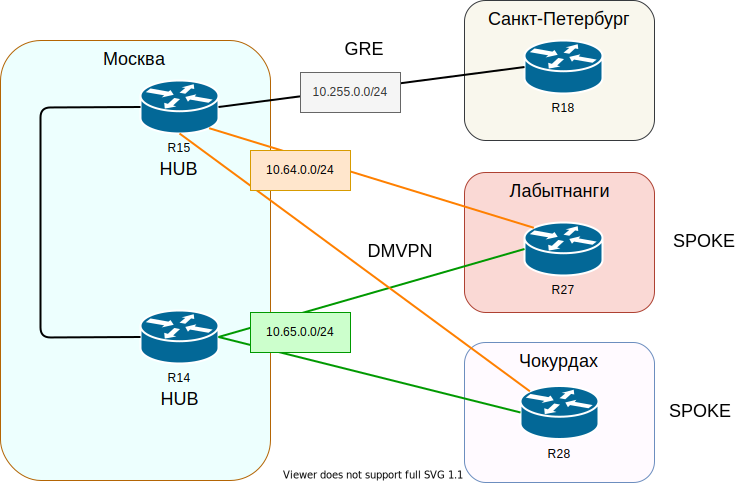

## Виртуальные частные сети - VPN


### Цель:

##### Настроить GRE между офисами Москва и С.-Петербург Настроить DMVPN между офисами Москва и Чокурдах, Лабытнанги

1. Настроить GRE между офисами Москва и С.-Петербург
2. Настроить DMVMN между Москва и Чокурдах, Лабытнанги
3. Все узлы в офисах в лабораторной работе должны иметь IP связность


##### Топология туннелей:



Настройка GRE туннеля и маршрутизации OSPF внутри туннеля

На R15:

```
interface Tunnel300
 ip address 10.255.0.1 255.255.255.0
 ip ospf network point-to-point
 ip ospf 1 area 17
 tunnel source 98.0.31.2
 tunnel destination 198.0.52.10
```

```
router ospf 1
no passive-interface Tunnel 300
```

на R18:

```
interface Tunnel300
 ip address 10.255.0.2 255.255.255.0
 ip ospf network point-to-point
 ip ospf 1 area 17
 tunnel source 198.0.52.10
 tunnel destination 98.0.31.2
```

```
router ospf 1
no passive-interface Tunnel 300
```

Настроим редистрибуцию маршрутов из EIGRP в OSPF на маршрутизаторе R18

```
router ospf 1
 redistribute eigrp 10 metric-type 1 subnets
```

Проверим доступность с компьютера в Москве 172.16.0.10 до компьютера в Санкт-Петербурге 172.17.0.10

```
VPCS> trace 172.17.0.10
trace to 172.17.0.10, 8 hops max, press Ctrl+C to stop
 1   172.16.0.4   1.449 ms  0.727 ms  0.845 ms
 2   172.16.32.33   1.287 ms  1.292 ms  1.657 ms
 3   172.16.32.9   1.860 ms  2.064 ms  1.811 ms
 4   10.255.0.2   3.052 ms  2.768 ms  3.726 ms
 5   172.17.32.2   3.623 ms  3.465 ms  3.229 ms
 6   172.17.32.10   3.674 ms  4.048 ms  4.816 ms
 7   *172.17.0.10   6.564 ms (ICMP type:3, code:3, Destination port unreachable)

VPCS> ping 172.17.0.10

84 bytes from 172.17.0.10 icmp_seq=1 ttl=58 time=4.324 ms
84 bytes from 172.17.0.10 icmp_seq=2 ttl=58 time=3.753 ms
84 bytes from 172.17.0.10 icmp_seq=3 ttl=58 time=4.933 ms
84 bytes from 172.17.0.10 icmp_seq=4 ttl=58 time=4.135 ms
84 bytes from 172.17.0.10 icmp_seq=5 ttl=58 time=4.462 ms
```


Настройка туннелей DMVPN и маршрутизации OSPF внутри туннеля:

На R14 (HUB)

```
interface Tunnel200
 ip address 10.65.0.1 255.255.255.0
 no ip redirects
 ip mtu 1400
 ip nhrp authentication OTUS
 ip nhrp map multicast dynamic
 ip nhrp network-id 102
 ip nhrp holdtime 600
 ip tcp adjust-mss 1360
 ip ospf network broadcast
 ip ospf priority 255
 ip ospf 1 area 0
 tunnel source 188.0.1.2
 tunnel mode gre multipoint
 tunnel key 102
```

```
router ospf 1
 router-id 0.0.0.14
 passive-interface default
 no passive-interface Tunnel200
```

R15 (HUB)

```
interface Tunnel100
 ip address 10.64.0.1 255.255.255.0
 no ip redirects
 ip mtu 1400
 ip nhrp authentication OTUS
 ip nhrp map multicast dynamic
 ip nhrp network-id 101
 ip nhrp holdtime 600
 ip tcp adjust-mss 1360
 ip ospf network broadcast
 ip ospf priority 255
 ip ospf 1 area 0
 tunnel source Ethernet0/2
 tunnel mode gre multipoint
 tunnel key 101
```

```
router ospf 1
 router-id 0.0.0.15
 passive-interface default
 no passive-interface Tunnel100
```

На R27

```
interface Tunnel200
 ip address 10.65.0.2 255.255.255.0
 no ip redirects
 ip mtu 1400
 ip nhrp authentication OTUS
 ip nhrp map 10.65.0.1 188.0.1.2
 ip nhrp map multicast 188.0.1.2
 ip nhrp network-id 102
 ip nhrp holdtime 600
 ip nhrp nhs 10.65.0.1
 ip tcp adjust-mss 1360
 ip ospf network broadcast
 ip ospf priority 0
 ip ospf 1 area 0
 tunnel source Ethernet0/0
 tunnel mode gre multipoint
```

```
router ospf 1
 router-id 27.27.27.27
 passive-interface default
 no passive-interface Tunnel100
 no passive-interface Tunnel200
 no passive-interface Ethernet0/1
```

На R28

```
interface Tunnel200
 ip address 10.65.0.3 255.255.255.0
 no ip redirects
 ip mtu 1400
 ip nhrp authentication OTUS
 ip nhrp map 10.65.0.1 188.0.1.2
 ip nhrp map multicast 188.0.1.2
 ip nhrp network-id 102
 ip nhrp holdtime 600
 ip nhrp nhs 10.65.0.1
 ip tcp adjust-mss 1360
 ip ospf network broadcast
 ip ospf priority 0
 ip ospf 1 area 0
 tunnel source Ethernet0/1
 tunnel mode gre multipoint
```

```
router ospf 1
 router-id 28.28.28.28
 passive-interface default
 no passive-interface Tunnel100
 no passive-interface Tunnel200
 no passive-interface Ethernet0/2
```

Таблица маршрутизации на R14:

```
R14#sh ip route
Codes: L - local, C - connected, S - static, R - RIP, M - mobile, B - BGP
       D - EIGRP, EX - EIGRP external, O - OSPF, IA - OSPF inter area
       N1 - OSPF NSSA external type 1, N2 - OSPF NSSA external type 2
       E1 - OSPF external type 1, E2 - OSPF external type 2
       i - IS-IS, su - IS-IS summary, L1 - IS-IS level-1, L2 - IS-IS level-2
       ia - IS-IS inter area, * - candidate default, U - per-user static route
       o - ODR, P - periodic downloaded static route, H - NHRP, l - LISP
       a - application route
       + - replicated route, % - next hop override

Gateway of last resort is 172.16.32.6 to network 0.0.0.0

O*E2  0.0.0.0/0 [110/1] via 172.16.32.6, 03:14:14, Ethernet0/0
                [110/1] via 172.16.32.2, 03:14:14, Ethernet0/1
      10.0.0.0/8 is variably subnetted, 4 subnets, 2 masks
O        10.64.0.0/24 [110/1020] via 172.16.32.6, 01:19:12, Ethernet0/0
                      [110/1020] via 172.16.32.2, 01:19:12, Ethernet0/1
C        10.65.0.0/24 is directly connected, Tunnel200
L        10.65.0.1/32 is directly connected, Tunnel200
O IA     10.255.0.0/24 [110/1020] via 172.16.32.6, 00:02:07, Ethernet0/0
                       [110/1020] via 172.16.32.2, 00:02:07, Ethernet0/1
      12.0.0.0/32 is subnetted, 1 subnets
O        12.12.12.12 [110/11] via 172.16.32.6, 03:15:08, Ethernet0/0
      13.0.0.0/32 is subnetted, 1 subnets
O        13.13.13.13 [110/11] via 172.16.32.2, 03:15:08, Ethernet0/1
      14.0.0.0/32 is subnetted, 1 subnets
C        14.14.14.14 is directly connected, Loopback0
      15.0.0.0/32 is subnetted, 1 subnets
O        15.15.15.15 [110/21] via 172.16.32.6, 03:14:38, Ethernet0/0
                     [110/21] via 172.16.32.2, 03:15:08, Ethernet0/1
      172.16.0.0/16 is variably subnetted, 17 subnets, 3 masks
O IA     172.16.0.0/23 [110/21] via 172.16.32.6, 03:15:08, Ethernet0/0
                       [110/21] via 172.16.32.2, 03:15:05, Ethernet0/1
O IA     172.16.8.0/23 [110/21] via 172.16.32.6, 03:15:08, Ethernet0/0
                       [110/21] via 172.16.32.2, 03:15:05, Ethernet0/1
C        172.16.32.0/30 is directly connected, Ethernet0/1
L        172.16.32.1/32 is directly connected, Ethernet0/1
C        172.16.32.4/30 is directly connected, Ethernet0/0
L        172.16.32.5/32 is directly connected, Ethernet0/0
O        172.16.32.8/30 [110/20] via 172.16.32.6, 03:15:08, Ethernet0/0
O        172.16.32.12/30 [110/20] via 172.16.32.2, 03:15:08, Ethernet0/1
C        172.16.32.16/30 is directly connected, Ethernet0/3
L        172.16.32.17/32 is directly connected, Ethernet0/3
O IA     172.16.32.20/30 [110/30] via 172.16.32.6, 03:14:38, Ethernet0/0
                         [110/30] via 172.16.32.2, 03:15:08, Ethernet0/1
O IA     172.16.32.24/30 [110/20] via 172.16.32.6, 03:15:08, Ethernet0/0
O IA     172.16.32.28/30 [110/20] via 172.16.32.6, 03:15:08, Ethernet0/0
O IA     172.16.32.32/30 [110/20] via 172.16.32.2, 03:15:08, Ethernet0/1
O IA     172.16.32.36/30 [110/20] via 172.16.32.2, 03:15:08, Ethernet0/1
O E2     172.16.255.4/32 [110/20] via 172.16.32.6, 03:14:58, Ethernet0/0
                         [110/20] via 172.16.32.2, 03:14:48, Ethernet0/1
O        172.16.255.19/32 [110/11] via 172.16.32.18, 03:15:08, Ethernet0/3
      172.17.0.0/16 is variably subnetted, 5 subnets, 3 masks
O E1     172.17.0.0/23 [110/1040] via 172.16.32.6, 00:02:02, Ethernet0/0
                       [110/1040] via 172.16.32.2, 00:02:02, Ethernet0/1
O E1     172.17.8.0/23 [110/1040] via 172.16.32.6, 00:02:02, Ethernet0/0
                       [110/1040] via 172.16.32.2, 00:02:02, Ethernet0/1
O E1     172.17.32.0/27 [110/1040] via 172.16.32.6, 00:02:02, Ethernet0/0
                        [110/1040] via 172.16.32.2, 00:02:02, Ethernet0/1
O E1     172.17.32.0/30 [110/1040] via 172.16.32.6, 00:02:02, Ethernet0/0
                        [110/1040] via 172.16.32.2, 00:02:02, Ethernet0/1
O E1     172.17.32.4/30 [110/1040] via 172.16.32.6, 00:02:02, Ethernet0/0
                        [110/1040] via 172.16.32.2, 00:02:02, Ethernet0/1
      172.18.0.0/16 is variably subnetted, 3 subnets, 2 masks
O IA     172.18.0.0/24 [110/1011] via 10.65.0.3, 01:03:32, Tunnel200
O IA     172.18.8.0/24 [110/1011] via 10.65.0.3, 01:03:32, Tunnel200
O IA     172.18.32.0/30 [110/1010] via 10.65.0.3, 01:03:32, Tunnel200
      172.19.0.0/24 is subnetted, 1 subnets
O IA     172.19.0.0 [110/1010] via 10.65.0.2, 01:02:09, Tunnel200
      188.0.0.0/16 is variably subnetted, 2 subnets, 2 masks
C        188.0.1.0/30 is directly connected, Ethernet0/2
L        188.0.1.2/32 is directly connected, Ethernet0/2
```

Таблица маршрутизации на R15

```
R15#sh ip route
Codes: L - local, C - connected, S - static, R - RIP, M - mobile, B - BGP
       D - EIGRP, EX - EIGRP external, O - OSPF, IA - OSPF inter area
       N1 - OSPF NSSA external type 1, N2 - OSPF NSSA external type 2
       E1 - OSPF external type 1, E2 - OSPF external type 2
       i - IS-IS, su - IS-IS summary, L1 - IS-IS level-1, L2 - IS-IS level-2
       ia - IS-IS inter area, * - candidate default, U - per-user static route
       o - ODR, P - periodic downloaded static route, H - NHRP, l - LISP
       a - application route
       + - replicated route, % - next hop override

Gateway of last resort is 98.0.31.1 to network 0.0.0.0

B*    0.0.0.0/0 [20/0] via 98.0.31.1, 03:12:57
      10.0.0.0/8 is variably subnetted, 5 subnets, 2 masks
C        10.64.0.0/24 is directly connected, Tunnel100
L        10.64.0.1/32 is directly connected, Tunnel100
O        10.65.0.0/24 [110/1020] via 172.16.32.14, 00:00:55, Ethernet0/0
                      [110/1020] via 172.16.32.10, 00:00:55, Ethernet0/1
C        10.255.0.0/24 is directly connected, Tunnel300
L        10.255.0.1/32 is directly connected, Tunnel300
      12.0.0.0/32 is subnetted, 1 subnets
O        12.12.12.12 [110/11] via 172.16.32.10, 00:00:55, Ethernet0/1
      13.0.0.0/32 is subnetted, 1 subnets
O        13.13.13.13 [110/11] via 172.16.32.14, 00:00:55, Ethernet0/0
      14.0.0.0/32 is subnetted, 1 subnets
O        14.14.14.14 [110/21] via 172.16.32.14, 00:00:55, Ethernet0/0
                     [110/21] via 172.16.32.10, 00:00:55, Ethernet0/1
      15.0.0.0/32 is subnetted, 1 subnets
C        15.15.15.15 is directly connected, Loopback0
      98.0.0.0/8 is variably subnetted, 4 subnets, 2 masks
C        98.0.31.0/29 is directly connected, Ethernet0/2
L        98.0.31.2/32 is directly connected, Ethernet0/2
L        98.0.31.3/32 is directly connected, Ethernet0/2
L        98.0.31.4/32 is directly connected, Ethernet0/2
      172.16.0.0/16 is variably subnetted, 17 subnets, 3 masks
O IA     172.16.0.0/23 [110/21] via 172.16.32.14, 00:00:55, Ethernet0/0
                       [110/21] via 172.16.32.10, 00:00:55, Ethernet0/1
O IA     172.16.8.0/23 [110/21] via 172.16.32.14, 00:00:55, Ethernet0/0
                       [110/21] via 172.16.32.10, 00:00:55, Ethernet0/1
O        172.16.32.0/30 [110/20] via 172.16.32.14, 00:00:55, Ethernet0/0
O        172.16.32.4/30 [110/20] via 172.16.32.10, 00:00:55, Ethernet0/1
C        172.16.32.8/30 is directly connected, Ethernet0/1
L        172.16.32.9/32 is directly connected, Ethernet0/1
C        172.16.32.12/30 is directly connected, Ethernet0/0
L        172.16.32.13/32 is directly connected, Ethernet0/0
O IA     172.16.32.16/30 [110/30] via 172.16.32.14, 00:00:55, Ethernet0/0
                         [110/30] via 172.16.32.10, 00:00:55, Ethernet0/1
C        172.16.32.20/30 is directly connected, Ethernet0/3
L        172.16.32.21/32 is directly connected, Ethernet0/3
O IA     172.16.32.24/30 [110/20] via 172.16.32.10, 00:00:55, Ethernet0/1
O IA     172.16.32.28/30 [110/20] via 172.16.32.10, 00:00:55, Ethernet0/1
O IA     172.16.32.32/30 [110/20] via 172.16.32.14, 00:00:55, Ethernet0/0
O IA     172.16.32.36/30 [110/20] via 172.16.32.14, 00:00:55, Ethernet0/0
O E2     172.16.255.4/32 [110/20] via 172.16.32.14, 00:00:55, Ethernet0/0
                         [110/20] via 172.16.32.10, 00:00:55, Ethernet0/1
O IA     172.16.255.19/32 [110/31] via 172.16.32.14, 00:00:55, Ethernet0/0
                          [110/31] via 172.16.32.10, 00:00:55, Ethernet0/1
      172.17.0.0/16 is variably subnetted, 5 subnets, 3 masks
O E1     172.17.0.0/23 [110/1020] via 10.255.0.2, 00:00:50, Tunnel300
O E1     172.17.8.0/23 [110/1020] via 10.255.0.2, 00:00:50, Tunnel300
O E1     172.17.32.0/27 [110/1020] via 10.255.0.2, 00:00:50, Tunnel300
O E1     172.17.32.0/30 [110/1020] via 10.255.0.2, 00:00:50, Tunnel300
O E1     172.17.32.4/30 [110/1020] via 10.255.0.2, 00:00:50, Tunnel300
      172.18.0.0/16 is variably subnetted, 3 subnets, 2 masks
O IA     172.18.0.0/24 [110/1011] via 10.64.0.3, 00:00:55, Tunnel100
O IA     172.18.8.0/24 [110/1011] via 10.64.0.3, 00:00:55, Tunnel100
O IA     172.18.32.0/30 [110/1010] via 10.64.0.3, 00:00:55, Tunnel100
      172.19.0.0/24 is subnetted, 1 subnets
O IA     172.19.0.0 [110/1010] via 10.64.0.2, 00:00:55, Tunnel100
```

Таблица маршрутизации на R27

```
R27>sh ip route
Codes: L - local, C - connected, S - static, R - RIP, M - mobile, B - BGP
       D - EIGRP, EX - EIGRP external, O - OSPF, IA - OSPF inter area
       N1 - OSPF NSSA external type 1, N2 - OSPF NSSA external type 2
       E1 - OSPF external type 1, E2 - OSPF external type 2
       i - IS-IS, su - IS-IS summary, L1 - IS-IS level-1, L2 - IS-IS level-2
       ia - IS-IS inter area, * - candidate default, U - per-user static route
       o - ODR, P - periodic downloaded static route, H - NHRP, l - LISP
       a - application route
       + - replicated route, % - next hop override

Gateway of last resort is 198.0.52.41 to network 0.0.0.0

S*    0.0.0.0/0 [1/0] via 198.0.52.41
      10.0.0.0/8 is variably subnetted, 5 subnets, 2 masks
C        10.64.0.0/24 is directly connected, Tunnel100
L        10.64.0.2/32 is directly connected, Tunnel100
C        10.65.0.0/24 is directly connected, Tunnel200
L        10.65.0.2/32 is directly connected, Tunnel200
O IA     10.255.0.0/24 [110/2000] via 10.64.0.1, 00:03:05, Tunnel100
      12.0.0.0/32 is subnetted, 1 subnets
O        12.12.12.12 [110/1011] via 10.65.0.1, 01:03:08, Tunnel200
                     [110/1011] via 10.64.0.1, 00:19:42, Tunnel100
      13.0.0.0/32 is subnetted, 1 subnets
O        13.13.13.13 [110/1011] via 10.65.0.1, 01:03:08, Tunnel200
                     [110/1011] via 10.64.0.1, 00:19:42, Tunnel100
      14.0.0.0/32 is subnetted, 1 subnets
O        14.14.14.14 [110/1001] via 10.65.0.1, 01:03:08, Tunnel200
      15.0.0.0/32 is subnetted, 1 subnets
O        15.15.15.15 [110/1001] via 10.64.0.1, 00:19:42, Tunnel100
      172.16.0.0/16 is variably subnetted, 14 subnets, 3 masks
O IA     172.16.0.0/23 [110/1021] via 10.65.0.1, 01:03:08, Tunnel200
                       [110/1021] via 10.64.0.1, 00:19:42, Tunnel100
O IA     172.16.8.0/23 [110/1021] via 10.65.0.1, 01:03:08, Tunnel200
                       [110/1021] via 10.64.0.1, 00:19:42, Tunnel100
O        172.16.32.0/30 [110/1010] via 10.65.0.1, 01:03:08, Tunnel200
O        172.16.32.4/30 [110/1010] via 10.65.0.1, 01:03:08, Tunnel200
O        172.16.32.8/30 [110/1010] via 10.64.0.1, 00:19:42, Tunnel100
O        172.16.32.12/30 [110/1010] via 10.64.0.1, 00:19:42, Tunnel100
O IA     172.16.32.16/30 [110/1010] via 10.65.0.1, 01:03:08, Tunnel200
O IA     172.16.32.20/30 [110/1010] via 10.64.0.1, 00:19:42, Tunnel100
O IA     172.16.32.24/30 [110/1020] via 10.65.0.1, 01:03:08, Tunnel200
                         [110/1020] via 10.64.0.1, 00:19:42, Tunnel100
O IA     172.16.32.28/30 [110/1020] via 10.65.0.1, 01:03:08, Tunnel200
                         [110/1020] via 10.64.0.1, 00:19:42, Tunnel100
O IA     172.16.32.32/30 [110/1020] via 10.65.0.1, 01:03:08, Tunnel200
                         [110/1020] via 10.64.0.1, 00:19:42, Tunnel100
O IA     172.16.32.36/30 [110/1020] via 10.65.0.1, 01:03:08, Tunnel200
                         [110/1020] via 10.64.0.1, 00:19:42, Tunnel100
O E2     172.16.255.4/32 [110/20] via 10.65.0.1, 01:03:08, Tunnel200
                         [110/20] via 10.64.0.1, 00:19:42, Tunnel100
O IA     172.16.255.19/32 [110/1011] via 10.65.0.1, 01:03:08, Tunnel200
      172.17.0.0/16 is variably subnetted, 5 subnets, 3 masks
O E1     172.17.0.0/23 [110/2020] via 10.64.0.1, 00:03:00, Tunnel100
O E1     172.17.8.0/23 [110/2020] via 10.64.0.1, 00:03:00, Tunnel100
O E1     172.17.32.0/27 [110/2020] via 10.64.0.1, 00:03:00, Tunnel100
O E1     172.17.32.0/30 [110/2020] via 10.64.0.1, 00:03:00, Tunnel100
O E1     172.17.32.4/30 [110/2020] via 10.64.0.1, 00:03:00, Tunnel100
      172.18.0.0/16 is variably subnetted, 3 subnets, 2 masks
O IA     172.18.0.0/24 [110/1011] via 10.65.0.3, 01:03:08, Tunnel200
                       [110/1011] via 10.64.0.3, 00:19:42, Tunnel100
O IA     172.18.8.0/24 [110/1011] via 10.65.0.3, 01:03:08, Tunnel200
                       [110/1011] via 10.64.0.3, 00:19:42, Tunnel100
O IA     172.18.32.0/30 [110/1010] via 10.65.0.3, 01:03:08, Tunnel200
                        [110/1010] via 10.64.0.3, 00:19:42, Tunnel100
      172.19.0.0/16 is variably subnetted, 2 subnets, 2 masks
C        172.19.0.0/24 is directly connected, Ethernet0/1
L        172.19.0.1/32 is directly connected, Ethernet0/1
      198.0.52.0/24 is variably subnetted, 2 subnets, 2 masks
C        198.0.52.40/29 is directly connected, Ethernet0/0
L        198.0.52.42/32 is directly connected, Ethernet0/0
```

Проверим доступность всех узлов сети от компьютера 172.19.0.10 в Лабытнанги до остальных офисов

Москва

```
VPCS> ping 172.16.0.10

84 bytes from 172.16.0.10 icmp_seq=1 ttl=60 time=10.865 ms
84 bytes from 172.16.0.10 icmp_seq=2 ttl=60 time=4.572 ms
84 bytes from 172.16.0.10 icmp_seq=3 ttl=60 time=5.013 ms
84 bytes from 172.16.0.10 icmp_seq=4 ttl=60 time=7.477 ms
84 bytes from 172.16.0.10 icmp_seq=5 ttl=60 time=3.935 ms

VPCS> trace 172.16.0.10
trace to 172.16.0.10, 8 hops max, press Ctrl+C to stop
 1   172.19.0.1   0.609 ms  0.336 ms  0.261 ms
 2   10.65.0.1   3.537 ms  4.453 ms  3.013 ms
 3   172.16.32.6   3.593 ms  3.143 ms  3.163 ms
 4   172.16.32.30   4.149 ms  4.211 ms  8.279 ms
 5   *172.16.0.10   3.538 ms (ICMP type:3, code:3, Destination port unreachable)
```

Санкт-Петербург

```
VPCS> ping 172.17.0.10

84 bytes from 172.17.0.10 icmp_seq=1 ttl=57 time=8.439 ms
84 bytes from 172.17.0.10 icmp_seq=2 ttl=57 time=5.947 ms
84 bytes from 172.17.0.10 icmp_seq=3 ttl=57 time=5.107 ms
84 bytes from 172.17.0.10 icmp_seq=4 ttl=57 time=5.279 ms
84 bytes from 172.17.0.10 icmp_seq=5 ttl=57 time=5.961 ms

VPCS> trace 172.17.0.10
trace to 172.17.0.10, 8 hops max, press Ctrl+C to stop
 1   172.19.0.1   0.474 ms  0.359 ms  0.656 ms
 2   10.64.0.1   3.017 ms  2.222 ms  2.459 ms
 3   10.255.0.2   3.888 ms  4.236 ms  4.050 ms
 4   172.17.32.2   5.183 ms  4.090 ms  4.172 ms
 5   172.17.32.10   4.648 ms  5.122 ms  10.147 ms
 6   *172.17.0.10   5.343 ms (ICMP type:3, code:3, Destination port unreachable)
```

Чокурдах

```
VPCS> ping 172.18.0.10

84 bytes from 172.18.0.10 icmp_seq=1 ttl=60 time=6.796 ms
84 bytes from 172.18.0.10 icmp_seq=2 ttl=61 time=2.064 ms
84 bytes from 172.18.0.10 icmp_seq=3 ttl=61 time=6.120 ms
84 bytes from 172.18.0.10 icmp_seq=4 ttl=61 time=7.219 ms
84 bytes from 172.18.0.10 icmp_seq=5 ttl=61 time=6.046 ms

VPCS> trace 172.18.0.10
trace to 172.18.0.10, 8 hops max, press Ctrl+C to stop
 1   172.19.0.1   0.296 ms  0.378 ms  0.394 ms
 2   10.65.0.3   1.790 ms  1.667 ms  1.323 ms
 3   172.18.32.2   2.105 ms  1.883 ms  1.830 ms
 4   *172.18.0.10   2.419 ms (ICMP type:3, code:3, Destination port unreachable)
```

